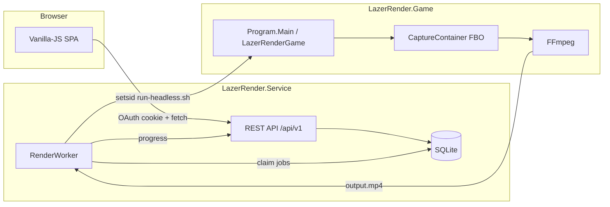
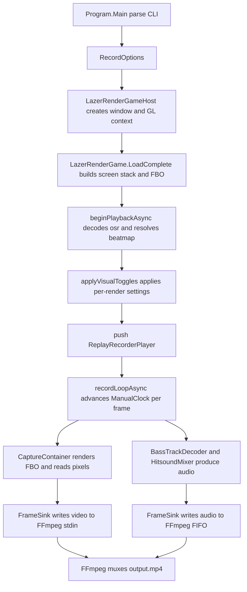

# LazerRender — Architecture Guide

This document explains the whole LazerRender codebase from zero: what it is, how it works, what every
file and class does, and how to connect new components to it. It is written so that a junior
developer can read it top to bottom and understand the project without prior knowledge of osu!
internals.

The project is two cooperating halves, documented as two parts after a shared overview:

- **Part 2 — The Engine** ([`LazerRender.Game`](LazerRender.Game)): the headless recorder that turns
  an `.osr` replay into an `.mp4`.
- **Part 3 — The Service** ([`LazerRender.Service`](LazerRender.Service)): the ASP.NET Core web app
  that turns the engine into a multi-user website.

---

## Part 1 — Overview

### 1.1 What this project is

LazerRender is a **headless, faster-than-realtime replay renderer** for osu!lazer, built as two
cooperating halves.

**The engine** ([`LazerRender.Game`](LazerRender.Game)) takes an `.osr` replay file, replays it
through the *real* osu!lazer game engine (not a reimplementation), captures the rendered frames from
the GPU, pipes them into FFmpeg, and produces an `.mp4` video complete with music and hitsounds. The
key idea is to **wrap the real game engine instead of reimplementing gameplay**: the osu!lazer client
([`LazerRender.Game/extern/osu`](LazerRender.Game/extern/osu)) is a pinned git submodule, and LazerRender drives it exactly like a
player would — but with a fake clock so it can render faster than real time and without a visible
window. The engine is designed to run on a home server, maintains its own persistent Realm database
of beatmaps and skins, and exposes a command-line interface plus a machine-readable stdout contract.

**The service** ([`LazerRender.Service`](LazerRender.Service)) is the web application that wraps that
CLI into a multi-user, o!rdr-like site: a user logs in with their **osu! account** (OAuth v2),
uploads a replay, picks render settings, and the service queues the job, runs the engine **one job at
a time**, streams progress back, stores the finished `.mp4`, and lets the user download it. It is an
**ASP.NET Core (.NET 10)** API + SQLite database + a **vanilla-JS single-page app** (no framework, no
build step).

The two halves never share in-process code: the service invokes the engine exactly like a shell user
would (a child process under [`LazerRender.Game/scripts/run-headless.sh`](LazerRender.Game/scripts/run-headless.sh)), and they exchange
data through the engine's CLI + stdout JSON contract (section 1.5).

### 1.2 Repository layout

Top level only. The internals of the two halves are expanded in section 2.2 (engine) and section 3.3
(service), so no tree is duplicated across the three sections.

```
LazerRender/
├── LazerRender.sln                  Engine solution (the recorder)
├── README.md                        User-facing overview
├── ROADMAP.md                       Phased development plan
├── ARCHITECTURE.md                  This file (engine + service)
├── MAINTENANCE.md                   Maintenance runbook (re-pin, breakage repair, debug workflow)
├── SECURITY.md                      Security model, finding register and accepted risks
├── Dockerfile                       Two-stage image holding both halves (section 1.6)
├── docker-compose.yml               Compose stack for Docker / Portainer (section 1.6)
├── .dockerignore                    Keeps build output, runtime data and dev/ out of the context
├── .gitignore                       Excludes runtime data, dev/ notes and editor config
├── .gitmodules                      Pins LazerRender.Game/extern/osu
├── LazerRender.Game/                The engine — self-contained, expanded in 2.2
├── LazerRender.Service/             The web service — self-contained, expanded in 3.3
└── dev/
    ├── prompts/                     Historical task prompts (not shipped)
    └── reports/                     Historical progress/design reports (not shipped)
```

Three things are not ordinary C#:

- [`LazerRender.Game/extern/osu`](LazerRender.Game/extern/osu) is a **git submodule** pinned to a specific release tag
  (`2026.918.0-tachyon`). It is the actual game code. Never edit it directly; re-pin it with git.
- **FFmpeg** is an external binary on `PATH`. The engine spawns it for encoding; the service spawns
  it for encoder probing.
- **Weston** is an external headless compositor used by `run-headless.sh` to give the engine a
  GPU-backed EGL context on a server with no desktop.

Both halves are self-contained products; the only cross-boundary dependency is the engine's
`run-headless.sh`, which the service spawns as a child process.

### 1.3 Build and run

**Engine**

```bash
dotnet build LazerRender.sln
```

The build outputs `LazerRender.Game/bin/Debug/net10.0/LazerRender.dll`. The engine needs a real
GPU-backed EGL context but no visible window; on a headless server it runs under a throwaway Weston
compositor:

```bash
LazerRender.Game/scripts/run-headless.sh --replay LazerRender.Game/tests/replay_nm_short.osr --output out --storage LazerRender.Game/storage \
    --fps 60 --width 1920 --height 1080 --encoder amd
```

**Service**

```bash
dotnet build LazerRender.Service/LazerRender.Service.sln
dotnet run --project LazerRender.Service/src/LazerRender.Api/LazerRender.Api.csproj --launch-profile http
dotnet test LazerRender.Service/LazerRender.Service.sln
LazerRender.Service/scripts/publish-service.sh linux-x64    # self-contained publish for a server without .NET
```

In development the service listens on `http://localhost:5080` (Swagger at `/swagger`, SPA at `/`,
API under `/api/v1`) and writes runtime data to `LazerRender.Service/src/LazerRender.Api/data/`
(gitignored).

**Containers**

```bash
docker compose up -d --build          # host port 5180 -> container 5080
```

See section 1.6.

### 1.4 The big picture (end to end)



The two halves have very different internals but a clean boundary:

- **Engine:** a single invocation does one operation (render / import / purge / map-info). A manual
  clock advances time per frame; video is captured from the GPU FBO while audio is decoded offline,
  and FFmpeg muxes them.
- **Service:** the database is the queue; one `RenderWorker` claims jobs atomically and runs the
  engine serially behind a semaphore, persisting the stdout progress and finalizing the result.

### 1.5 How the engine and the service connect

The engine speaks two "languages" to the outside world:

1. **A command-line surface** — verbs `--replay`, `--import-map`, `--import-skin`, `--purge`,
   `--map-info`, plus render options and per-render settings (section 2.7). The service reuses these
   verbs directly (renders, asset imports, purge, metadata lookup).
2. **A stdout supervisor contract** — while rendering, the engine writes machine-readable JSON
   progress lines (`PARSING → RENDERING_FRAMES → RESULTS_TAIL → FINALIZING → DONE`) and can be
   aborted with SIGINT/SIGTERM (section 2.10.1).

The service's [`RendererProcessRunner`](LazerRender.Service/src/LazerRender.Api/Services/RendererProcessRunner.cs:36)
spawns the engine under `setsid` via [`LazerRender.Game/scripts/run-headless.sh`](LazerRender.Game/scripts/run-headless.sh), passes
`--replay --output --storage --render-config --encoder`, parses those stdout lines, and maps them to
job rows + progress events. The `--render-config` JSON the service writes is exactly the schema in
[`WEB_GUI_GUIDE.md`](LazerRender.Game/WEB_GUI_GUIDE.md), mirrored by
[`RenderConfig`](LazerRender.Service/src/LazerRender.Contracts/RenderConfig.cs:10). The full
end-to-end path is in section 3.11.

### 1.6 The container image

The [`Dockerfile`](Dockerfile) is a two-stage build that produces **one** image containing both
halves, because the service cannot function without the engine and they are versioned together:

```
build stage (mcr.microsoft.com/dotnet/sdk:8.0)
  dotnet publish LazerRender.Game  -c Release -r linux-x64 -> /out/engine
  dotnet publish LazerRender.Api   -c Release -r linux-x64 -> /out/api

runtime stage (mcr.microsoft.com/dotnet/aspnet:8.0)
  /app/                                  <- /out/api   (content root; ASPNETCORE_CONTENTROOT=/app)
  /app/LazerRender.Game/publish/         <- /out/engine
  /app/LazerRender.Game/scripts/run-headless.sh
  /app/data   (volume)   /app/keys   (volume, mode 0700, owner-only)
  USER lazerrender (uid 10001)   EXPOSE 5080
```

Two properties matter more than the layout:

- **The engine ships as a *published* app, not as source.** `LAZERRENDER_ENGINE` is set to
  `/app/LazerRender.Game/publish/LazerRender.dll`, which switches `run-headless.sh` into its prebuilt
  mode (section 2.11). That is what keeps the SDK, the source tree and the pinned osu! submodule out of
  the running image, and it is why the image needs only the .NET runtime.
- **The key ring is a volume, never a layer.** `/app/keys` holds the Data Protection key that decrypts
  every stored osu! credential, so it is created `0700` at build time and only ever mounted. Same for
  `/app/data` (SQLite, uploads, results, the engine's Realm storage).

`docker-compose.yml` wraps the image with GPU render nodes (`/dev/dri/renderD*` only), `shm_size: 1gb`,
the `.env`-driven settings, and a `/health` healthcheck; it publishes on host port **5180** to avoid
clashing with neighbouring stacks. The operational detail — device-node selection on multi-GPU hosts,
the reverse-proxy/forwarded-header consequences of a container network, and verifying that a render
actually runs on the GPU — is in [`DEPLOYMENT.md`](LazerRender.Service/DEPLOYMENT.md) §11.

---

## Part 2 — The Engine (LazerRender.Game)

### 2.1 What the engine is

LazerRender is a **headless, faster-than-realtime replay recorder** for osu!lazer. It takes an `.osr`
replay file, replays it through the *real* osu!lazer game engine (not a reimplementation), captures
the rendered frames from the GPU, pipes them into FFmpeg, and produces an `.mp4` video complete with
music and hitsounds.

The key idea: **wrap the real game engine instead of reimplementing gameplay.** The osu!lazer client
([`LazerRender.Game/extern/osu`](LazerRender.Game/extern/osu)) is a pinned git submodule; LazerRender drives it exactly like a player
would, but with a fake clock so it can render faster than real time and without a visible window.

It is designed to run on a home server as the backend for a web application (similar to o!rdr; now
implemented in Part 3). It maintains its own persistent Realm database of beatmaps and skins, and
exposes a command-line interface a web backend can drive.

### 2.2 Where the engine lives

The engine is **self-contained**: everything it needs to build, run and test lives inside
[`LazerRender.Game`](LazerRender.Game).

```
LazerRender.Game/                    All recorder C# code + engine assets
├── LazerRender.Game.csproj          Project file (references extern/osu projects)
├── Program.cs                       CLI entry point + argument parser
├── RecordOptions.cs                 Parsed CLI options model
├── SettingDescriptor.cs             Per-render settings table + parser + dispatcher
├── HudVisibilityFilter.cs           HUD component whitelist
├── LazerRenderGameHost.cs           Platform window/GL host wrapper
├── LazerRenderGame.cs               Game entry point (subclass of OsuGameBase)
├── CaptureContainer.cs              FBO capture + GPU readback pipeline
├── ReplayRecorderPlayer.cs          The recording loop (subclass of ReplayPlayer)
├── ExtendedResultsScreen.cs         Results-screen customization
├── FrameSink.cs                     FFmpeg process + pipe muxing
├── BassTrackDecoder.cs              Offline music track decoding (BASS)
├── HitsoundMixer.cs                 Hitsound interception (reflection into BASS)
├── RenderState.cs                   Process-wide cancellation token
├── WEB_GUI_GUIDE.md                 Engine CLI / supervisor contract
├── extern/osu/                      Pinned ppy/osu checkout (git submodule, DO NOT edit)
├── scripts/
│   ├── run-headless.sh              Weston headless-compositor launcher
│   └── fetch-bearer-token.sh        osu! API v2 client-credentials token fetcher
├── storage/                         Persistent Realm DB + managed files (runtime data)
├── tests/                           .osr replay test fixtures
└── out/                             Default render output directory (gitignored)
```

Only two things are not ordinary C#:

- [`LazerRender.Game/extern/osu`](LazerRender.Game/extern/osu) is a **git submodule** pinned to a specific release tag
  (`2026.918.0-tachyon`). It is the actual game code. Never edit it directly; re-pin it with git.
- **FFmpeg** is an external binary on `PATH`. LazerRender spawns it as a child process.

### 2.3 Build and run (engine)

```bash
dotnet build LazerRender.sln
```

The build outputs `LazerRender.Game/bin/Debug/net10.0/LazerRender.dll`.

LazerRender needs a real GPU-backed EGL context (it renders with OpenGL), but no visible window. For
a truly headless server you run it under a throwaway Weston compositor:

```bash
LazerRender.Game/scripts/run-headless.sh --replay LazerRender.Game/tests/replay_nm_short.osr --output out --storage LazerRender.Game/storage \
    --fps 60 --width 1920 --height 1080 --encoder amd
```

`LazerRender.Game/scripts/run-headless.sh` starts `weston --backend=headless --renderer=gl` on an isolated Wayland
socket, runs LazerRender against it, and tears Weston down afterwards. See section 2.11.

### 2.4 The big picture: what happens during a render

A single invocation does exactly one operation. For a render, the flow is:



The two most important concepts:

1. **A manual clock drives time.** Wall-clock and vsync are ignored. Each recorded frame advances a
   `ManualClock` by exactly `1000 / fps` milliseconds, so the render can run at whatever speed the
   hardware allows (faster than real time).

2. **Video and audio are captured separately and muxed by FFmpeg.** Video goes through the GPU FBO
   readback into FFmpeg's stdin; audio is decoded offline (music + hitsounds) and written to a named
   FIFO that FFmpeg reads.

### 2.5 File-by-file walkthrough (engine)

#### 2.5.1 [`Program.cs`](LazerRender.Game/Program.cs:1) — entry point

Responsibilities:

- Create a `CancellationTokenSource` and store its token in
  [`RenderState.CancellationToken`](LazerRender.Game/RenderState.cs:14).
- Register `Ctrl+C` (`Console.CancelKeyPress`), `SIGINT` and `SIGTERM`
  (`PosixSignalRegistration`) handlers that cancel the token — so an external supervisor can abort a
  job cleanly.
- Parse the command line (`parse(args)`) into a [`RecordOptions`](LazerRender.Game/RecordOptions.cs:57).
  If parsing fails, print usage and return exit code `2`.
- Validate that the file required by the selected mode exists, and create the output and storage
  directories.
- Construct a [`LazerRenderGameHost`](LazerRender.Game/LazerRenderGameHost.cs:19) and run a
  [`LazerRenderGame`](LazerRender.Game/LazerRenderGame.cs:49) on it. Return exit code `0`.

Exit codes: `0` = success, `2` = command-line/validation error. A failed render logs an error and
exits the host (the process still returns `0` from `Main`; the failure is visible in the log).

The parser recognizes:

- **Commands (exactly one required):** `--replay <path.osr>`, `--replay-info <path.osr>`,
  `--import-map <path>`, `--import-skin <path>`, `--purge <beatmaps|skins|all>`, `--map-info <md5>`.
- **Render options:** `--skin`, `--output`, `--storage`, `--width`, `--height`, `--fps`,
  `--duration`, `--secrets-file`, `--avatar-api-key`, `--osu-user-token`, `--osu-user-token-expires-in`,
  `--motion-blur`, `--download-missing`, `--hud-scale`, `--disable-result-screen`,
  `--leaderboard-scope`, `--encoder`,
  `--render-config`.
- **Settings flags** (data-driven, see 2.5.3): `--<flag>`, `--no-<flag>` for booleans, and
  `--<flag> <value>` for numeric/enum settings. Unknown flags are looked up in
  [`SettingsCatalog`](LazerRender.Game/SettingDescriptor.cs:79); if not found, usage is printed.
- **HUD whitelist:** `--hud <key> [<key> ...]` — space- and/or comma-separated and repeatable (see
  2.5.4).
- **Legacy aliases:** `--disable-storyboard`, `--disable-video`, `--hide-overlay` (they set the same
  table entries as the new flags).

#### 2.5.2 [`RecordOptions.cs`](LazerRender.Game/RecordOptions.cs:1) — options model

Three types:

- `enum RunMode { Record, ImportMap, ImportSkin, Purge, MapInfo, ReplayInfo }` — which operation to perform.
- `enum EncoderKind { Cpu, Amd, Nvidia, Intel }` — the FFmpeg video encoder backend.
- `sealed class RecordOptions` — all parsed options. Notable fields:

| Field | Purpose |
|---|---|
| `Mode` | selected `RunMode` |
| `ReplayPath` / `ImportMapPath` / `ImportSkinPath` | input files per mode |
| `MapInfoHash` | beatmap MD5 for `--map-info` |
| `SkinName` | optional skin to apply (looked up in Realm) |
| `Encoder` | `EncoderKind` |
| `PurgeTarget` | `beatmaps` / `skins` / `all` |
| `DownloadMissing` | auto-download missing beatmap (`--download-missing`) |
| `HudScale` | extra UI-scale multiplier (`--hud-scale`) |
| `OutputDirectory` / `StorageDirectory` | output dir / persistent Realm dir |
| `Width` / `Height` / `Fps` | output resolution / draw rate |
| `DurationSeconds` | optional clip length (null = full replay + results tail) |
| `Settings` | `Dictionary<string, object>` of per-render setting overrides (keyed by `SettingDescriptor.Key`) |
| `HudComponents` | `HashSet<string>` whitelist of HUD component keys to keep (`--hud`) |
| `HudSpecified` | whether `--hud`/`hud` was provided at all; distinguishes "show everything" from an explicit empty whitelist ("hide every HUD element") |
| `DisableResultScreen` | skip the results screen and fade to black at the end of the replay instead (`--disable-result-screen`); the fade runs ~1.0 s, like the results-tail fade but quicker |
| `LeaderboardScope` | which beatmap leaderboard to warm for the scoreboard (`--leaderboard-scope`): `global` (default), `country`, `friend` or `team`. Mirrors the scope a player can pick in song select; only meaningful with a user token. `country`/`friend` require supporter and `team` requires a team, so `global` is the only unconditional choice |
| `MotionBlurFrames` | FFmpeg `tmix` frame count |
| `AvatarApiKey` | osu! API v2 token for the avatar lookup |
| `OsuUserToken` / `OsuUserTokenExpiresIn` | osu! API v2 **user** token used to sign lazer in (enables online leaderboards) and its validity |

#### 2.5.3 [`SettingDescriptor.cs`](LazerRender.Game/SettingDescriptor.cs:1) — the settings system

This is the single source of truth for every per-render visual/gameplay setting.

- `enum SettingTarget { Global, Ruleset }` — which config manager owns the setting.
- `enum SettingValueKind { Bool, Float, Double, Int, Enum }` — the value type.
- `sealed class SettingDescriptor` — one setting: `Key` (JSON key, e.g. `dimLevel`), `Flag` (CLI
  stem, e.g. `dim-level`), `Target`, `Lookup` (the enum member to set), `Kind`, `Min`/`Max`/`Step`
  (validation), `DefaultValue`, `EnumValues` (name → value map for enums), `Inverted` (only used by
  `video`, which stores `PreferNoVideo` inverted), and `Description`.

- `static class SettingsCatalog` — `All` is the list of descriptors. The settings are split across
  two osu! config managers:
  - **Global** settings live in `OsuConfigManager` (`OsuSetting` enum) and are set via
    `LocalConfig.SetValue`.
  - **osu! ruleset** settings live in `OsuRulesetConfigManager` (`OsuRulesetSetting` enum) and are
    set via the ruleset config obtained from `IRulesetConfigCache`.

- `static class SettingsEngine` — does the actual work:
  - `TryParseCli(descriptor, raw, out value, out error)` — parse + validate a CLI value.
  - `TryParseJson(descriptor, JsonElement, out value, out error)` — parse + validate a JSON value.
  - `Apply(localConfig, rulesetConfig, overrides)` — iterate every catalog entry and apply the
    override or the default. This preserves the "set every value explicitly each run" guarantee so
    persisted state cannot leak between renders.
  - `setValue` / `setEnumValue` — typed dispatch; enum values are applied through reflection because
    they are boxed with their runtime type.

**How to add a new setting:** add one entry to `SettingsCatalog.Build()` using the `global(...)` or
`ruleset(...)` helper. CLI parsing, validation, `--help`, the `--render-config` JSON schema, and the
apply dispatch all pick it up automatically. Nothing else needs to change.

#### 2.5.4 [`HudVisibilityFilter.cs`](LazerRender.Game/HudVisibilityFilter.cs:1) — HUD component whitelist

Hides HUD components by matching their drawable **type** against osu!lazer's component classes, then
setting `Alpha = 0`. This is the same technique used elsewhere for the replay banner and the results
toolbar; it does not manipulate serialized skin data.

[`ApplyWhitelist(hudRoot, keepKeys)`](LazerRender.Game/HudVisibilityFilter.cs:108) hides every HUD
component that is **not** in the keep set (`--hud`). This is scoped to the skinnable HUD component
containers (`SkinnableContainer` with a
`GlobalSkinnableContainerLookup(GlobalSkinnableContainers.MainHUDComponents)`, i.e. the global and
ruleset HUD containers), so the playfield, cursor and gameplay elements are never affected. Fixed
controls (the hold-to-quit button and the failing layer) are always hidden; the mod display is only
kept when `mods` is whitelisted. `FindHudComponentContainers(hudRoot)` exposes those containers so
`ReplayRecorderPlayer` can subscribe to `SkinnableContainer.OnComponentsLoaded` and re-apply the
filter the instant the asynchronously loaded skin components are inserted.

[`AllKeys`](LazerRender.Game/HudVisibilityFilter.cs:66) is the whitelist vocabulary (also surfaced by
`--hud` and the service's `hud` key):

| Key | Matched types |
|---|---|
| `hp` | `HealthDisplay` (→ `DefaultHealthDisplay`, `ArgonHealthDisplay`, `LegacyHealthDisplay`) |
| `combo` | `ComboCounter` (→ `DefaultComboCounter`, `ArgonComboCounter`, not `LongestComboCounter`) **and** `LegacyDefaultComboCounter` |
| `score` | `GameplayScoreCounter` (→ `DefaultScoreCounter`, `ArgonScoreCounter`, `LegacyScoreCounter`) |
| `keyoverlay` | `KeyCounterDisplay` (→ `ArgonKeyCounterDisplay`, `LegacyKeyCounterDisplay`) |
| `accuracy` | `GameplayAccuracyCounter` (→ `DefaultAccuracyCounter`, `ArgonAccuracyCounter`, `LegacyAccuracyCounter`) |
| `pp` | `PerformancePointsCounter` (→ Argon/Triangles/Legacy) |
| `hiterror` | `HitErrorMeter` (→ `BarHitErrorMeter`, `ColourHitErrorMeter`, `LegacyBarHitErrorMeter`), excluding `AimErrorMeter` |
| `song-progress` | `SongProgress` (→ `DefaultSongProgress`, `ArgonSongProgress`, `LegacySongProgress`) |
| `unstable-rate` | `UnstableRateCounter` (→ Argon/Triangles) |
| `judgements` | `JudgementCounterDisplay` **and** `ArgonJudgementCounterDisplay` (no shared base) |
| `mods` | `ModDisplay`, `SkinnableModDisplay`, `ModFlowDisplay` |
| `aim-error` | `AimErrorMeter` (osu! ruleset; hit position relative to the aim direction) |
| `rank` | `DefaultRankDisplay` **and** `LegacyRankDisplay` (no shared base) |
| `longest-combo` | `LongestComboCounter` |
| `scoreboard` | `DrawableGameplayLeaderboard` |
| `bpm` | `BPMCounter` |
| `cps` | `ClicksPerSecondCounter` |
| `player-name` | `PlayerName` |
| `avatar` | `PlayerAvatar` |
| `flags` | `PlayerFlag`, `PlayerTeamFlag` |
| `spectators` | `SpectatorList` |
| `cosmetic` | `ArgonWedgePiece`, `BigBlackBox`, `BoxElement`, `TextElement`, `BeatmapAttributeText`, `SkinnableSprite` |

Whitelist mode only engages when the whitelist is *provided at all* (`RecordOptions.HudSpecified`):
because the SPA ships an all-on checklist, it omits `hud` while every box is ticked (show
everything, decorations included), sends the still-ticked keys once any box is unticked, and sends an
explicit empty list when every box is unticked (hide every HUD element).

Two gotchas: `LegacyDefaultComboCounter` does **not** derive from `ComboCounter`, and
`DefaultRankDisplay`/`ArgonJudgementCounterDisplay` have no common base with their legacy/default
counterparts, so each needs an explicit match. `LongestComboCounter` derives from `ComboCounter`, so
it is excluded from `combo` to stay independently selectable; likewise `AimErrorMeter` derives from
`HitErrorMeter`, so `hiterror` excludes it. The filter walks the drawable tree via reflection into
`CompositeDrawable.InternalChildren` and logs the concrete types it touched.

#### 2.5.5 [`LazerRenderGameHost.cs`](LazerRender.Game/LazerRenderGameHost.cs:19) — platform host

- Disables vsync at the driver level by setting `vblank_mode=0` (Mesa) and `__GL_SYNC_TO_VBLANK=0`
  (NVIDIA) before the host is created. This is what lets an offscreen FBO render faster than the
  compositor's frame callback.
- Calls `Host.GetSuitableDesktopHost("lazer-render", new HostOptions { IPCPipeName = null,
  PortableInstallation = true })` to get a real, GPU-backed desktop host. `IPCPipeName = null`
  avoids contending with a live osu!lazer instance.
- Owns the [`ManualClock`](LazerRender.Game/LazerRenderGameHost.cs:31) that drives all scene-graph
  time.
- `Run(game)` forwards to `Host.Run(game)`.

#### 2.5.6 [`LazerRenderGame.cs`](LazerRender.Game/LazerRenderGame.cs:41) — the game

Subclasses `OsuGameBase`, so it inherits osu!lazer's real database, ruleset, beatmap and skin
infrastructure without pulling in the menu/overlay UI.

- [`SetHost`](LazerRender.Game/LazerRenderGame.cs:77) re-sources the update thread's clock to the
  recorder's `ManualClock`.
- [`GetFrameworkConfigDefaults`](LazerRender.Game/LazerRenderGame.cs:97) sets a fixed window size,
  `FrameSync.Unlimited`, a silent audio device, and `ExecutionMode.SingleThread` (update and draw
  strictly ordered — required for deterministic capture).
- [`CreateStorage`](LazerRender.Game/LazerRenderGame.cs:115) redirects all storage (including
  `client.realm`) to the `--storage` directory.
- [`LoadComplete`](LazerRender.Game/LazerRenderGame.cs:118) hides the window, lifts the inactive-Hz
  throttle, then either runs an import/purge/map-info, or builds the recording UI: a
  [`CaptureContainer`](LazerRender.Game/CaptureContainer.cs:36) (FBO) wrapping a
  `DrawSizePreservingFillContainer` (1024×768 reference layout scaled to the output) wrapping an
  `OsuScreenStack`, then schedules `beginPlaybackAsync`.
- `importBeatmapAsync` / `importSkinAsync` / `purgeAsync` implement the import/purge modes.
- `mapInfoAsync` implements `--map-info`: queries `BeatmapManager.QueryBeatmap` by MD5 hash (with
  `--download-missing` it downloads + imports the map first) and prints a JSON line (`found`,
  `title`, `artist`, `creator`, `version`, `stars`), with `creator = beatmap.Metadata.Author?.Username ?? ""`.
- `replayInfoAsync` implements `--replay-info`: decodes the replay and prints a JSON line with the
  render duration/rate plus the beatmap metadata (`title`/`artist`/`creator`/`version`/`stars`),
  `songLengthSeconds`, the concatenated mod acronyms (`mods`) and the score `accuracy` (0..1).
- [`beginPlaybackAsync`](LazerRender.Game/LazerRenderGame.cs:431) is the render orchestrator:
  1. Yield to let async game components finish loading.
  2. Apply settings ([`applyVisualToggles`](LazerRender.Game/LazerRenderGame.cs:984)).
  3. Read the beatmap MD5 hash from the `.osr` header; if missing and `--download-missing`, download
     and import it first.
  4. Decode the `.osr` via the private `DatabaseLegacyScoreDecoder` (resolves the hash against the
     Realm DB).
  5. Look up the player's avatar ([`applyAvatarAsync`](LazerRender.Game/LazerRenderGame.cs:652)).
  6. Warm the online beatmap leaderboard ([`warmLeaderboardAsync`](LazerRender.Game/LazerRenderGame.cs:853)).
  7. Load the working beatmap track, apply the requested skin, read the track audio bytes, compute
     the DT/HT audio rate from the mods, and push a `ReplayRecorderPlayer`.
- [`UseDevelopmentServer`](LazerRender.Game/LazerRenderGame.cs:75) is overridden to `false` so the engine
  always talks to the production endpoints. lazer picks `dev.ppy.sh` for debug builds
  (`DebugUtils.IsDebugBuild`), and the recorder normally runs from source via `dotnet run` — i.e. a
  debug build. A production user token is not valid there, so `/me` answered 401, lazer logged itself
  out, and online beatmap leaderboards stayed empty with only "not logged in" to show for it. The
  endpoint in use is logged alongside the leaderboard result, so a future mismatch is obvious.
- [`SetHost`](LazerRender.Game/LazerRenderGame.cs:77) also injects the optional `--osu-user-token`
  into `OsuSetting.Token` (via [`applyOsuUserToken`](LazerRender.Game/LazerRenderGame.cs:782)). This
  runs after `base.SetHost` (which creates `LocalConfig`) but before `OsuGameBase.load` constructs
  `APIAccess`, which reads and validates that token against `/me` — so it is the same
  persistent-login path the desktop client uses, and it is what makes online leaderboards work.
  The token is cleared again from persistent config in `Dispose`
  ([`clearOsuUserToken`](LazerRender.Game/LazerRenderGame.cs:782)), so a render host does not leave a
  live bearer token in the engine's ini file.
- [`downloadBeatmapAsync`](LazerRender.Game/LazerRenderGame.cs:578) downloads a missing beatmap:
  - Primary: osu.direct `/api/v2/md5/{hash}` (JSON) → `beatmapset_id` → `/d/{setId}` (`.osz`).
  - Fallback: catboy.best `/api/md5/{hash}` → `ParentSetID` → `/d/{setId}`.
  - A `User-Agent` header is set explicitly (catboy.best 403s requests without one).
- [`applyAvatarAsync`](LazerRender.Game/LazerRenderGame.cs:652) propagates the replay's own user id
  (`ScoreInfo.RealmUser.OnlineID`) onto the score's `APIUser` — `DrawableAvatar` refuses to load a
  remote avatar unless `OnlineID > 1`, which is why the results screen and the `avatar` HUD element
  previously always showed the guest icon. It then optionally enriches the user via
  `GET /api/v2/users/{username}` (id, `avatar_url`, `country_code`) and pre-warms the texture
  through the very `OnlineAssetCachingStore` `DrawableAvatar` reads (this prevents a 1080p segfault
  from a late remote texture upload).
- `warmLeaderboardAsync` fetches the beatmap's online scores before the player is pushed, for the
  scope given by `--leaderboard-scope` (`global` by default) — the same scope a player would have
  picked in song select, which lazer otherwise carries in from `PlayerLoader`. The
  recorder bypasses the song-select/player-loader flow that normally calls
  `LeaderboardManager.FetchWithCriteria`, and the gameplay scoreboard provider reads the result
  exactly once as it loads, so this call is what makes the `scoreboard` HUD element show the
  beatmap's top scores instead of only the replaying player. It is skipped when the API is not
  logged in or the beatmap has no online id. A non-null `LeaderboardScores.FailState` is reported
  verbatim (with an explanation) rather than being mistaken for a slow request — `LeaderboardManager`
  rejects the fetch outright for `NotLoggedIn`, `BeatmapUnavailable`, `NotSupporter`, `NoTeam` and
  `RulesetUnavailable`, so waiting for a timeout would hide the real reason.
- [`ReplayRecorderPlayer`](LazerRender.Game/ReplayRecorderPlayer.cs:36) enables
  `PlayerConfiguration.ShowLeaderboard` only when the `scoreboard` HUD element was actually
  requested. lazer's `DrawableGameplayLeaderboard` hides its scores whenever that flag is false —
  independently of the HUD filter — so the recorder used to force it off and make the element
  impossible to render.
- [`getOsuRulesetConfig`](LazerRender.Game/LazerRenderGame.cs:994) obtains the osu! ruleset config
  via `RulesetStore.GetRuleset(0).CreateInstance()` → `IRulesetConfigCache.GetConfigFor(ruleset)`.
- `applyRequestedSkin` looks up the skin by name (exact, then `<name> [<archive>]` prefix). When no
  skin is requested (or it cannot be found) it applies the built-in osu! "argon" pro skin via
  `applyDefaultSkin` instead of leaving lazer's argon default in place.
- `readTrackAudio` reads the beatmap's audio file bytes from Realm file storage.
- `createHitsoundMixer` builds the reflection-based hitsound hook and converts the sample mixer to
  offline decode.
- Nested `DatabaseLegacyScoreDecoder` overrides `GetRuleset` (ruleset store) and `GetBeatmap`
  (Realm query by MD5 hash).

#### 2.5.7 [`CaptureContainer.cs`](LazerRender.Game/CaptureContainer.cs:36) — FBO capture

The heart of video capture. It wraps the screen stack in a `BufferedDrawNode`-backed framebuffer
object (FBO) and exposes a deterministic readback of that buffer.

- The FBO colour attachment is **8-bit RGBA** (verified at runtime via `glGetFramebufferAttachmentParameter`).
- [`CaptureAsync`](LazerRender.Game/CaptureContainer.cs:120):
  - First awaits a `SemaphoreSlim` (`readbackSlots`, capacity 5). This **paces** the recorder loop
    to the FFmpeg sink so the draw thread never blocks on a full queue (this is what fixed a
    deadlock; see section 2.8).
  - Then bumps the draw version and invalidates the draw node, and awaits the frame render.
- [`onFrameBufferRendered`](LazerRender.Game/CaptureContainer.cs:148) runs on the draw thread:
  1. Reads the FBO with `glReadPixels(GL_UNSIGNED_BYTE)` into a 5-buffer `GL_PIXEL_PACK_BUFFER`
     ring (zero-copy DMA).
  2. Completes the pending capture task (releases the recorder loop).
  3. Maps the PBO filled four frames prior (DMA complete by then), copies its 8.3 MB into a pooled
     byte array, and hands it to the readback queue.
- [`readbackPbo`](LazerRender.Game/CaptureContainer.cs:273) does the GL map/copy/unmap on the draw
  thread (where the GL context is current).
- [`ensureReadbackPipeline`](LazerRender.Game/CaptureContainer.cs:302) runs a background thread that
  consumes the readback queue and calls `frameConsumer` (the FFmpeg sink's `EnqueueFrame`). It
  releases the semaphore slot as soon as it takes a frame off the queue.
- `IBufferedDrawable` members (`FrameBufferScale`, `BackgroundColour`, `TextureShader`) make the FBO
  scale to exactly the requested output size.
- `CaptureDrawNode` culls the scene when `FlatFillMode` is on (`LAZERRENDER_FLATFILL=1`), which is a
  diagnostic to isolate readback/encode cost from scene-render cost.

#### 2.5.8 [`ReplayRecorderPlayer.cs`](LazerRender.Game/ReplayRecorderPlayer.cs:31) — the recording loop

Subclasses osu!lazer's `ReplayPlayer`.

- On construction it disables results, retries, pause, skip and leaderboard.
- [`OnEntering`](LazerRender.Game/ReplayRecorderPlayer.cs:139): skip the intro, capture the current
  gameplay time, replace the gameplay clock source with a private `AdjustableManualClock`, and start
  `recordLoopAsync`.
- [`LoadComplete`](LazerRender.Game/ReplayRecorderPlayer.cs:160): hide the replay overlay ("Watching
  …" banner + cog), make the `hiddengameplay` HUD-visibility mode behave like for a human player
  (lazer force-shows the HUD for replays so the seek bar stays visible; the recorder instead hides it
  whenever `LocalUserPlaying` is true), and apply `HudVisibilityFilter` (immediately, on every
  `SkinnableContainer.OnComponentsLoaded`, and once more after 1.5 s as a safety net).
- [`recordLoopAsync`](LazerRender.Game/ReplayRecorderPlayer.cs:310) is the frame loop:
  1. Create a [`FfmpegFrameSink`](LazerRender.Game/FrameSink.cs:29) and start it (FFmpeg starts
     eagerly).
  2. Start the capture readback, wait for texture uploads to settle.
  3. Create a [`BassTrackDecoder`](LazerRender.Game/BassTrackDecoder.cs:19) for the music.
  4. Each iteration: advance the scene clock and gameplay clock by one frame, detect replay end,
     `await CaptureAsync()`, decode this frame's music + hitsounds, apply the tail fade, and write
     audio to the sink.
  5. Every 60 frames emit a JSON progress line.
  6. When the replay ends, push the results screen and keep recording a 5-second tail. During that
     tail the video *and* the remaining music fade to black over the final 1.5 s (3.5 s → 5.0 s), so
     the results screen is held readable before the video ends. With `--disable-result-screen` the
     recorder instead skips the results screen and runs the same fade immediately over 1.0 s
     (1.5× faster), then stops.
  7. At the end: flush the capture pipeline, finalize the sink, log `DONE`.
- [`attachGameplayClockToManualClock`](LazerRender.Game/ReplayRecorderPlayer.cs:292) swaps the
  gameplay clock's source (reflection into `GameplayClockContainer` / `FramedBeatmapClock`).
- [`waitForTextureUploadsToSettleAsync`](LazerRender.Game/ReplayRecorderPlayer.cs:483) polls the GL
  renderer's private `textureUploadQueue` until it drains (prevents a startup GPU crash).
- [`reportProgress`](LazerRender.Game/ReplayRecorderPlayer.cs:248) writes machine-readable JSON to
  stdout (the supervisor contract; see section 2.10).
- `reportTotalFrames` derives the natural total for unbounded renders (final input frame + results
  tail), so a supervisor can show a determinate progress bar. `recordingStartTime` can legitimately
  be `0`, so only the replay-end time and derived duration are used as guards.
- [`CreateResults`](LazerRender.Game/ReplayRecorderPlayer.cs:611) returns the
  [`ExtendedResultsScreen`](LazerRender.Game/ExtendedResultsScreen.cs:28).
- Nested `AdjustableManualClock` implements `IAdjustableClock` so the recorder can seek/advance the
  clock without the seek/rewind path that mutes hitsounds.

#### 2.5.9 [`ExtendedResultsScreen.cs`](LazerRender.Game/ExtendedResultsScreen.cs:21) — results screen

Subclasses `SoloResultsScreen`. For recording it:

- Disables retry and "watch replay".
- Skips the score panel "flair" animations (reflection into `ScorePanel.displayWithFlair`).
- Expands the main score panel instantly and shows the statistics panel, so the recorded results
  screen shows the full Performance Breakdown / Timing Distribution / Accuracy Heatmap immediately.
- Hides the bottom toolbar (`CollectionButton`, `FavouriteButton`, `ReplayDownloadButton`) before
  first draw and re-hides on a delayed scheduler pass.
- Short-circuits [`FetchScores`](LazerRender.Game/extern/osu/osu.Game/Screens/Ranking/ResultsScreen.cs:351)
  when the osu! API is not logged in. `SoloResultsScreen` otherwise requests the beatmap's online
  leaderboard to compute the player's rank/position, which fails with `NotLoggedIn` and adds a
  confusing log line to an otherwise clean render. With a token configured the real fetch is kept, so
  the results screen can show the player's global rank.
- Leaves the expanded panel's avatar to the shared `DrawableAvatar` path: it reads `Score.User`,
  whose online id and pre-warmed texture are set up by `LazerRenderGame` (see 2.5.2), so the recorded
  avatar is the replay player's real one without any API login.

#### 2.5.10 [`FrameSink.cs`](LazerRender.Game/FrameSink.cs:29) — FFmpeg muxing

Spawns a single FFmpeg process and feeds it video (stdin) and audio (a named FIFO).

- [`Start`](LazerRender.Game/FrameSink.cs:87): creates `audio.fifo` (`mkfifo`), opens it read+write,
  starts the audio writer thread, then starts FFmpeg **eagerly** (before the first frame) with the
  requested dimensions.
- [`EnqueueFrame`](LazerRender.Game/FrameSink.cs:128): size-guards the frame (aborts if the FBO
  shifted) and adds it to a bounded video queue (capacity 3).
- [`WriteAudio`](LazerRender.Game/FrameSink.cs:141): copies PCM into an unbounded audio queue.
- `startProcess` builds the FFmpeg arguments:
  - `-analyzeduration 0 -probesize 32` before *each* `-i`: both inputs are fully described on the
    command line, and letting FFmpeg analyse them instead is what deadlocks the pipeline on FFmpeg
    5.1 (section 2.8, item 3).
  - `buildHardwareInitArgs`: `-vaapi_device /dev/dri/renderD128` (AMD) or `-init_hw_device qsv=hw
    -filter_hw_device hw` (Intel).
  - `buildVideoFilterArgs`: merges the `tmix` motion-blur filter with the backend's
    `format=nv12,hwupload` (or QSV variant) into one `-vf` chain.
  - `buildEncoderArgs`: `h264_vaapi -qp 18`, `h264_nvenc -preset p4 -cq 18`,
    `h264_qsv -global_quality 18`, or `libx264 -crf 18 -preset fast`.
  - Audio: `-c:a aac -b:a 192k`.
- `startVideoWriter`: one background task drains the video queue and writes raw RGBA to FFmpeg stdin
  (the only blocking pipe write).
- `startStderrTelemetry`: logs FFmpeg lines containing `fps=` or `speed=` for diagnostics.
- [`Finish`](LazerRender.Game/FrameSink.cs:328): closes the video queue, closes stdin (video EOF),
  waits for the audio writer, closes the audio FIFO, waits for FFmpeg.
- `Dispose`: kills the FFmpeg process tree and deletes the FIFO.
- There is deliberately **no `-shortest` flag** — the recorder closes both inputs at `Finish`, so
  audio/video lengths stay matched (this also avoids a deadlock with motion blur; see section 2.8).

#### 2.5.11 [`BassTrackDecoder.cs`](LazerRender.Game/BassTrackDecoder.cs:19) — music decode

Decodes the beatmap's audio track offline through ManagedBass:

- Writes the audio bytes to a temp file, opens a BASS **decode** stream (no device output).
- If the mods change speed (DT/HT), wraps it in a BASS FX tempo stream.
- Feeds it into a 44100 Hz stereo decode mixer so reads always return the exact s16le layout FFmpeg
  expects.
- [`Read(seconds, buffer, byteCount)`](LazerRender.Game/BassTrackDecoder.cs:83) seeks to a track
  time and reads PCM, padding short reads with silence.

#### 2.5.12 [`HitsoundMixer.cs`](LazerRender.Game/HitsoundMixer.cs:26) — hitsound capture

Hitsounds are normally played through osu-framework's real-time BASS mixers, which cannot be
consumed faster than real time. This class uses **reflection** to:

- Find the framework's internal `AudioManager.ActiveMixers`.
- Swap each sample mixer's BASS handle for an equivalent **decode** mixer (skipping the music
  `TrackMixer`, which is decoded separately).
- [`Read`](LazerRender.Game/HitsoundMixer.cs:94) sums every captured mixer's float samples, clamps,
  and converts to s16le for one frame.

#### 2.5.13 [`RenderState.cs`](LazerRender.Game/RenderState.cs:12) — shared state

A tiny static holder for the process-wide `CancellationToken`. The recorder loop polls it so an
external supervisor (or Ctrl+C / SIGTERM) can abort a job.

#### 2.5.14 [`DebugInstrumentation.cs`](LazerRender.Game/DebugInstrumentation.cs:1) — debug/release gate

The engine half of the Phase 8.2 debug/release distinction. `Log(string)` is marked
`[Conditional("LAZERRENDER_DEBUG")]`, so its call sites and message formatting are removed from
Release builds; the symbol is defined for Debug builds by the repository-root
[`Directory.Build.props`](Directory.Build.props:1) (and can be forced in Release with
`-p:LazerRenderDebug=true`). `LogRuntime(string)` covers diagnostics that must stay switchable without
a rebuild — it is inert unless `LAZERRENDER_DEBUG=1` is set. See [`MAINTENANCE.md`](MAINTENANCE.md:1) §2
for the full debug-vs-release matrix.

### 2.6 The two osu! config managers

LazerRender reuses osu!lazer's own persistent config instead of inventing its own:

| Manager | Enum | How LazerRender reaches it |
|---|---|---|
| `OsuConfigManager` | `OsuSetting` | `LocalConfig` (inherited from `OsuGameBase`) |
| `OsuRulesetConfigManager` (osu! ruleset) | `OsuRulesetSetting` | `IRulesetConfigCache.GetConfigFor(osuRuleset)` |

Global settings (dim, blur, parallax, storyboard, video, skins, colours, hitsounds, combo colour
normalisation, cursor size, HUD visibility) are `OsuSetting` values. Ruleset settings (snaking, hit
animations, cursor trail/ripples, playfield border) and the replay-analysis overlays (click/frame
markers, cursor path, cursor hide, display length) are `OsuRulesetSetting` values. Both are set the
same way through [`SettingsEngine`](LazerRender.Game/SettingDescriptor.cs:167); only the config
manager differs.

### 2.7 The full CLI surface

#### Commands

| Command | Meaning |
|---|---|
| `--replay <path.osr>` | Render a replay (beatmap resolved from the embedded MD5 hash) |
| `--import-map <path.osu|osz>` | Import a beatmap into the persistent Realm DB |
| `--import-skin <path.osk>` | Import a legacy skin |
| `--purge <beatmaps|skins|all>` | Delete imported assets to reclaim disk space |
| `--map-info <md5>` | Print JSON metadata for an imported beatmap hash |
| `--replay-info <path.osr>` | Print JSON replay + beatmap metadata (duration, speed, title, stars, song length, mods, accuracy) |

#### Render options

`--skin <name>`, `--output <dir>`, `--storage <dir>`, `--width <px>`, `--height <px>`,
`--fps <n>`, `--duration <sec>`, `--download-missing`, `--hud-scale <n>`,
`--disable-result-screen`, `--leaderboard-scope <scope>`, `--avatar-api-key <key>`, `--osu-user-token <token>`,
`--osu-user-token-expires-in <sec>`, `--motion-blur <n>`,
`--encoder <cpu|amd|nvidia|intel>`, `--render-config <path>`.

#### Per-render settings

Booleans: `--<flag>` / `--no-<flag>`. Numeric/enum: `--<flag> <value>`. The full list is printed by
`--help` and defined in [`SettingsCatalog`](LazerRender.Game/SettingDescriptor.cs:79):

- Global: `dim-level`, `blur-level`, `parallax`, `storyboard`, `video`, `beatmap-skins`,
  `beatmap-colours`, `beatmap-hitsounds`, `combo-colour-normalisation`, `cursor-size`,
  `hud-visibility` (`never|hiddengameplay|always`), `hit-lighting`.
- Ruleset: `snaking-in`, `snaking-out`, `hit-animations`, `cursor-trail`, `cursor-ripples`,
  `playfield-border` (`none|corners|full`), `hide-gameplay-cursor`, `show-click-markers`,
  `show-frame-markers`, `show-cursor-path`, `replay-analysis-length`.

#### HUD whitelist

`--hud <key> [<key> ...]` (space- and/or comma-separated and repeatable) switches to whitelist mode:
only the listed components are shown, every other HUD component is hidden. The keys are
[`HudVisibilityFilter.AllKeys`](LazerRender.Game/HudVisibilityFilter.cs:66). An explicitly empty
`hud` in `--render-config` hides every HUD element; omitting the key entirely shows everything.

#### Legacy aliases (still accepted)

`--disable-storyboard` (= `--no-storyboard`), `--disable-video` (= `--no-video`),
`--hide-overlay` (= `--hud-visibility never`).

### 2.8 Concurrency and the three pipeline deadlocks (historical context)

The video pipeline is a chain of bounded queues with a single blocking point (the FFmpeg stdin
write):

```
draw thread (glReadPixels + PBO copy)
  → readbackQueue (capacity 5, consumed by readbackThread)
    → videoQueue (capacity 3, consumed by videoWriterThread)
      → FFmpeg stdin
```

Three deadlocks were fixed over time:

1. **90 fps lazy-start deadlock.** FFmpeg used to start lazily on the first frame; at 90 fps the
   startup burst filled the queues and deadlocked (FFmpeg waited for audio, video backpressure
   blocked the draw thread). Fix: start FFmpeg eagerly in `Start`.
2. **90 fps + motion-blur deadlock.** With `tmix` (motion blur) FFmpeg's output is delayed, and the
   old `-shortest` flag made FFmpeg stop reading the video pipe whenever audio momentarily stalled,
   which deadlocked the bounded queues. Fix: remove `-shortest` (the recorder closes both inputs at
   `Finish`), and add the `readbackSlots` semaphore so the recorder loop throttles to FFmpeg instead
   of blocking the draw thread.
3. **Stream-analysis startup deadlock (FFmpeg 5.1 only).** Before transcoding, FFmpeg reads a chunk of
   *every* input to work out what it is — and the audio FIFO is still empty at that point, because the
   recorder has not captured its first frame yet. On FFmpeg 5.1 (what Debian 12 ships) that read
   blocks, so FFmpeg never starts draining the video pipe, the bounded queues fill and the render
   wedges on frame one (`frame:0`, ffmpeg single-threaded and blocked in a read, the engine's video
   writer blocked in a pipe write). FFmpeg 9.x does not behave this way, which is why it only showed
   up inside the container image. Fix: pass `-analyzeduration 0 -probesize 32` before each `-i` in
   [`FfmpegFrameSink.startProcess`](LazerRender.Game/FrameSink.cs:152); both inputs are fully described
   on the command line (`-f`, `-s`, `-pix_fmt`, `-ar`, `-ac`), so the analysis is unnecessary anyway.

The invariant now: **the draw thread never blocks on a full queue**; backpressure is absorbed by the
semaphore in `CaptureAsync`, which paces the recorder loop gracefully — and FFmpeg must never block on
an *empty* input, which is what rule 3 guarantees.

### 2.9 External dependencies (engine)

- **[`LazerRender.Game/extern/osu`](LazerRender.Game/extern/osu)** — pinned `ppy/osu` checkout (submodule), tag `2026.918.0-tachyon`.
- **osu.Framework / osu.Game.Resources** — NuGet packages consumed by `osu.Game`.
- **ManagedBass** — BASS audio library bindings for offline music/hitsound decoding.
- **FFmpeg** — external binary on `PATH` (h264 encoding + muxing).
- **weston** — headless Wayland compositor used by `run-headless.sh`.
- **Mesa / GPU drivers** — OpenGL rendering and VAAPI/NVENC/QSV hardware encoding.

### 2.10 Extension points (engine)

#### 2.10.1 The supervisor contract (progress + cancellation)

While rendering, LazerRender writes machine-readable JSON lines to **stdout**:

```json
{"type":"progress","phase":"PARSING","frame":0,"total":null,"fps":0}
{"type":"progress","phase":"RENDERING_FRAMES","frame":60,"total":450,"fps":123.4}
{"type":"progress","phase":"RESULTS_TAIL","frame":450,"total":450,"fps":122.0}
{"type":"progress","phase":"FINALIZING","frame":450,"total":450,"fps":122.0}
{"type":"progress","phase":"DONE","frame":450,"total":450,"fps":122.5}
```

- `phase` is one of `PARSING`, `RENDERING_FRAMES`, `RESULTS_TAIL`, `FINALIZING`, `DONE`.
- `frame` is the frame count so far; `total` is the target (or `null` when unbounded).
- `fps` is the current render throughput.

To abort a job, send `SIGINT` or `SIGTERM` (or Ctrl+C). The recorder cancels
`RenderState.CancellationToken` and the FFmpeg sink kills its child process tree.

#### 2.10.2 The CLI contract for a supervisor

The recommended split (implemented by the service in Part 3):

- **Per-render settings** → a single `--render-config <path>` JSON document (or stdin with `-`).
- **Infra** (`--encoder`, `--output`, `--storage`) → decided by the instance manager, not the GUI.
- **Admin** (`--import-map`, `--import-skin`, `--purge`, `--map-info`) → instance management.

See [`WEB_GUI_GUIDE.md`](LazerRender.Game/WEB_GUI_GUIDE.md) for the exact JSON schema and invocation recipe.

#### 2.10.3 Adding a new setting

Add one descriptor to `SettingsCatalog.Build()` in
[`SettingDescriptor.cs`](LazerRender.Game/SettingDescriptor.cs:100). CLI parsing, `--help`, JSON
schema and dispatch all follow automatically.

#### 2.10.4 Adding a new HUD toggle

Add a key constant + type match to [`HudVisibilityFilter`](LazerRender.Game/HudVisibilityFilter.cs:33)
and register it in `AllKeys`. Wire it into `Program.cs` (the `--render-config` `hud` validation), the
service's
[`RenderConfigValidator`](LazerRender.Service/src/LazerRender.Api/Services/RenderConfigValidator.cs:9)
key list and the `HUD_ONLY_KEYS` array in `app.js`. It is then applied by `HudVisibilityFilter` from
`ReplayRecorderPlayer` (at `LoadComplete`, on every `SkinnableContainer.OnComponentsLoaded`, and once
more after 1.5 s as a safety net). Note that `--hud` whitelist mode only inspects the skinnable HUD
component containers, so a new key only needs to match types that appear there.

### 2.11 Scripts (engine)

- [`LazerRender.Game/scripts/run-headless.sh`](LazerRender.Game/scripts/run-headless.sh:1) — stands up a
  throwaway Weston compositor, runs the engine against it, and tears the compositor down. Details that
  are easy to get wrong:
  - **Weston's flags are probed, not hard-coded.** Weston 10 names backends by module file
    (`--backend=headless-backend.so`) and only knows `--use-gl`; newer releases accept the short
    `headless` name and prefer `--renderer=gl`. The script reads `weston --help` and picks a spelling
    that works on both, so the same script runs on a desktop distro and inside the container image.
  - **`XDG_RUNTIME_DIR` is exported.** Weston hard-fails without it, so when the variable is unset the
    script falls back to a secured per-user tmpdir *and exports it* — which is the case that matters
    inside a container.
  - **Weston output is logged, not discarded**, and printed if the socket never appears.
  - **Two run modes.** By default it runs `dotnet run --project .../LazerRender.Game.csproj -- <args>`
    (what a development checkout uses). When `LAZERRENDER_ENGINE` points at a published
    `LazerRender.dll`, it runs that instead, so the container host needs no SDK and no source tree.
  - Honors `LAZERRENDER_MESA_DRIVER` to force a Mesa driver (e.g. `zink` to route OpenGL over Vulkan).
- [`LazerRender.Game/scripts/fetch-bearer-token.sh`](LazerRender.Game/scripts/fetch-bearer-token.sh:1) — performs the
  osu! API v2 OAuth **client-credentials** grant (`scope=public`) and prints the access token.
  Requires `OSU_OAUTH_CLIENT_ID` and `OSU_OAUTH_CLIENT_SECRET` environment variables (never
  committed).
- [`LazerRender.Game/scripts/fetch-user-token.sh`](LazerRender.Game/scripts/fetch-user-token.sh:1) — exchanges an
  authorization **code** for a user access token + refresh token (needed for the online
  leaderboards). Requires `OSU_OAUTH_CLIENT_ID`, `OSU_OAUTH_CLIENT_SECRET`, `OSU_OAUTH_REDIRECT_URI`
  and `OSU_OAUTH_CODE`.

### 2.12 Where to start reading the code (engine)

1. [`Program.cs`](LazerRender.Game/Program.cs:1) — the entry point and CLI surface.
2. [`LazerRenderGame.cs`](LazerRender.Game/LazerRenderGame.cs:41) — the orchestration.
3. [`ReplayRecorderPlayer.cs`](LazerRender.Game/ReplayRecorderPlayer.cs:31) — the frame loop.
4. [`CaptureContainer.cs`](LazerRender.Game/CaptureContainer.cs:36) and
   [`FrameSink.cs`](LazerRender.Game/FrameSink.cs:29) — the video path.
5. [`BassTrackDecoder.cs`](LazerRender.Game/BassTrackDecoder.cs:19) and
   [`HitsoundMixer.cs`](LazerRender.Game/HitsoundMixer.cs:26) — the audio path.

---

## Part 3 — The Service (LazerRender.Service)

### 3.1 What the service is

The engine (Part 2) is a command-line program: you give it an `.osr` replay, and it produces an
`.mp4`. The service is the layer that turns that CLI into a **multi-user web application** (an
o!rdr-like site):

- A user logs in with their **osu! account** (OAuth v2).
- They upload a replay, pick render settings, and press "Queue render".
- A background worker runs the engine **one job at a time**, streams progress back, and stores the
  finished `.mp4`.
- The user downloads the video later.

The service is an **ASP.NET Core (.NET 10)** application with:

- a **REST API** under `/api/v1`,
- a **SQLite** database for users, jobs, skins and presets,
- a **single serialized background worker** that invokes the engine,
- a **vanilla-JS single-page app** (no framework, no build step) served from `wwwroot`.

The two big design decisions (documented in [`DESIGN_PLAN.md`](LazerRender.Service/DESIGN_PLAN.md))
are:

1. **No message broker.** Because one home server has one GPU, jobs are serialized with an in-process
   queue (a SQLite table + a semaphore). Redis/RabbitMQ would add operational cost for no throughput
   gain at this scale.
2. **ASP.NET Core over Node/Python.** The engine is C# on .NET 10, so the API shares the runtime,
   gives strongly-typed contracts, and can host a background service (`BackgroundService`) and
   SignalR for free.

### 3.2 Relationship to the engine

The service never calls engine code directly. It invokes the engine the same way a shell user would:

```
API worker ── setsid ──> LazerRender.Game/scripts/run-headless.sh ──> dotnet LazerRender.Game ... ──> FFmpeg
```

Specifically, it spawns [`LazerRender.Game/scripts/run-headless.sh`](LazerRender.Game/scripts/run-headless.sh) (the headless Weston
wrapper described in Part 2) with `--replay`, `--output`, `--storage`, `--render-config`,
`--encoder`, and reads the engine's **stdout JSON progress lines**. The engine's `--map-info` and
`--import-*` / `--purge` verbs are reused for metadata resolution and asset management. See section
3.11 for the exact child-process mechanics.

### 3.3 Where the service lives

The service is **self-contained**: everything it needs to build, run, test and deploy is inside
[`LazerRender.Service`](LazerRender.Service).

```
LazerRender.Service/
├── LazerRender.Service.sln          Solution (Api + Contracts + Tests)
├── DEPLOYMENT.md                    Deployment, configuration and systemd guide
├── DESIGN_PLAN.md                   Service design (job lifecycle, architecture choices)
├── deploy/
│   ├── Caddyfile                    Reverse-proxy (TLS termination) example
│   └── lazerrender.service          systemd unit
├── scripts/
│   └── publish-service.sh           Self-contained linux-x64 publish
├── src/
│   ├── LazerRender.Contracts/       Shared DTOs + enums (no ASP.NET dependency)
│   │   ├── RenderConfig.cs          Per-render settings document
│   │   ├── RenderProgress.cs        One engine stdout progress line
│   │   ├── JobStatus.cs             Job lifecycle enum + helpers
│   │   ├── RenderPhase.cs           Engine progress phases
│   │   ├── EncoderKind.cs           FFmpeg backend enum
│   │   └── Dtos.cs                  API response records
│   └── LazerRender.Api/             The web application
│       ├── Program.cs               Composition root (DI, middleware, pipeline)
│       ├── appsettings.json         Non-secret defaults
│       ├── appsettings.Development.json  Dev-only overrides (excluded from publish)
│       ├── Configuration/           Strongly-typed options classes
│       ├── Data/                    EF Core DbContext, entities, schema bootstrap
│       ├── Controllers/             HTTP endpoints
│       ├── Hubs/                    SignalR progress hub
│       ├── Services/                Business logic + background workers
│       └── wwwroot/                 The single-page frontend
└── tests/
    └── LazerRender.Worker.Tests/    xUnit tests (in-memory SQLite)
```

The only things the service reaches outside this directory for:

- **`LazerRender.Game/scripts/run-headless.sh`** — the engine's headless launcher that the worker
  spawns (section 2.2). In production set `Renderer__RunnerScript` to its deployed location.
- **FFmpeg** — an external binary on `PATH` used both for probing encoders and by the engine itself.

### 3.4 Build and run (service)

```bash
# Build the whole service solution
dotnet build LazerRender.Service/LazerRender.Service.sln

# Run the API in development (framework-dependent)
dotnet run --project LazerRender.Service/src/LazerRender.Api/LazerRender.Api.csproj --launch-profile http

# Run the tests
dotnet test LazerRender.Service/LazerRender.Service.sln

# Self-contained publish for a server without .NET installed
LazerRender.Service/scripts/publish-service.sh linux-x64
```

In development the app listens on `http://localhost:5080` (see
[`launchSettings.json`](LazerRender.Service/src/LazerRender.Api/Properties/launchSettings.json:1)):
Swagger UI at `/swagger`, the SPA at `/`, and the API under `/api/v1`. Runtime data (SQLite database,
uploads, results, the engine's Realm library, and the Data Protection key ring) is created under
`LazerRender.Service/src/LazerRender.Api/data/` and is gitignored.

### 3.5 The big picture: what happens when a user queues a render

```mermaid
flowchart TD
    A[Browser uploads .osr + config] --> B[POST /api/v1/jobs]
    B --> C[QuotaService check]
    C --> D[Stage replay to data/uploads]
    D --> E[ReplayFileParser reads MD5]
    E --> F[Job row created: Uploaded]
    F --> G[MapMetadataService resolves title, downloading the map if needed]
    G --> G2[Job: Queued]
    G2 --> H[RenderWorker claims oldest Queued job]
    H --> I[RenderLockService acquired]
    I --> J[RendererProcessRunner spawns run-headless.sh]
    J --> K[Engine writes JSON progress to stdout]
    K --> L[Worker persists progress + broadcasts SignalR]
    L --> M[Engine emits DONE]
    M --> N[output.mp4 moved to data/results]
    N --> O[Job: Completed]
    O --> P[GET /api/v1/jobs/{id}/result downloads the video]
```

Key concepts:

1. **One worker, one job at a time.** A single `RenderWorker` claims jobs from the `jobs` table and
   runs them serially. Serialization is enforced both by the worker loop and by a shared
   `RenderLockService` semaphore that also covers asset imports (the engine is only proven safe in
   single-operation mode).
2. **The database is the queue.** There is no in-memory queue that can be lost on restart. Queued
   jobs are rows with `Status = 'queued'`; claiming is an atomic `UPDATE ... WHERE Status = 'queued'`.
3. **Progress is best-effort.** The engine's stdout lines are parsed, written to the job row, and
   pushed over SignalR; the current SPA actually polls `GET /api/v1/jobs` every 2 seconds instead of
   holding a SignalR connection (see section 3.13).

### 3.6 File-by-file walkthrough (service)

#### 3.6.1 `LazerRender.Contracts` — the shared contract project

This project has **no** ASP.NET dependency, so a future CLI client or test harness can reference it
without pulling in the web stack.

##### [`RenderConfig.cs`](LazerRender.Service/src/LazerRender.Contracts/RenderConfig.cs:10)

The per-render settings document. It mirrors the engine's `--render-config` JSON schema
(see [`WEB_GUI_GUIDE.md`](LazerRender.Game/WEB_GUI_GUIDE.md)) one-to-one: `fps`, `width`, `height`, the visual/gameplay
booleans, HUD options (`hud`, `disableResultScreen`), `leaderboardScope`, `motionBlur`, `skin` and optional
`duration`. Every property has the engine's default, so the API can always serialize a complete
document. `Skin`, `Duration` and `Hud` are marked `[JsonIgnore(Condition = WhenWritingNull)]` so
a default config stays compact.

##### [`RenderProgress.cs`](LazerRender.Service/src/LazerRender.Contracts/RenderProgress.cs:9)

One engine stdout line, e.g. `{"type":"progress","phase":"RENDERING_FRAMES","frame":60,"total":450,"fps":123.4}`.
It exposes `ParsedPhase` (a [`RenderPhase`](LazerRender.Service/src/LazerRender.Contracts/RenderPhase.cs:7))
and `IsDone` helpers so consumers don't string-compare.

##### [`JobStatus.cs`](LazerRender.Service/src/LazerRender.Contracts/JobStatus.cs:7)

The lifecycle enum plus extension methods:

| Member | Meaning |
|---|---|
| `Uploaded`, `Validating`, `Stored`, `Rejected` | `Uploaded` is used transiently while a new job's beatmap metadata is resolved (the worker cannot claim it); `Validating`/`Stored` are design-time states from the phase-5 plan that the MVP skips. |
| `Queued` | Waiting to be claimed. |
| `Claimed` | Reserved by the worker (not yet started). |
| `Rendering` | Engine process running. |
| `Finalizing` | Engine emitted `FINALIZING` (muxing/output). |
| `Completed` | `output.mp4` stored and downloadable. |
| `Failed` | Exhausted retries with an error. |
| `Cancelling` | Cancellation requested; worker is stopping the process. |
| `Cancelled` | Cancellation finished. |

`IsTerminal()`, `IsCancellable()`, `IsRetryable()` are the predicates the controllers and worker use.

##### [`RenderPhase.cs`](LazerRender.Service/src/LazerRender.Contracts/RenderPhase.cs:7)

The engine's five phases (`PARSING → RENDERING_FRAMES → RESULTS_TAIL → FINALIZING → DONE`) as an
enum, with `Parse()` / `ToWire()` for string conversion.

##### [`EncoderKind.cs`](LazerRender.Service/src/LazerRender.Contracts/EncoderKind.cs:7)

`Cpu`, `Amd`, `Nvidia`, `Intel` — mirrors the engine's `--encoder` flag. Serialized as lowercase
strings (`cpu`, `amd`, `nvidia`, `intel`) by the JSON options in
[`Program.cs`](LazerRender.Service/src/LazerRender.Api/Program.cs:29).

##### [`Dtos.cs`](LazerRender.Service/src/LazerRender.Contracts/Dtos.cs:3)

All API response shapes: `JobDto` (the full job projection sent to the UI, including queue position
and map metadata), `JobCreatedResponse`, `JobListResponse`, `ApiUserDto`, `PresetDto`,
`PresetListResponse`, `AdminUserDto`, and `ErrorResponse` (the standard `{ "error", "detail" }`
error body).

##### [`LogRecord.cs`](LazerRender.Service/src/LazerRender.Contracts/LogRecord.cs:1)

The single log record model of the Phase 8.2 pipeline, shared with the (Phase 8.3) admin console:
`LogRecord(Sequence, Timestamp, Source, Severity, Message)` plus the `LogSource` (`Service` /
`Engine`) and `LogSeverity` (`Debug`/`Information`/`Warning`/`Error`) enums. It is our own severity
enum rather than `Microsoft.Extensions.Logging.LogLevel` because this project has no package
references. `Sequence` is per-buffer and monotonic, so a consumer polls with the last sequence it saw.

##### [`AdminDtos.cs`](LazerRender.Service/src/LazerRender.Contracts/AdminDtos.cs:1)

Phase 8.3 panel DTOs: `LogSnapshotDto` (a delta page plus `Dropped`/`Capacity`/`MinimumSeverity`/
`Cleared`) and `RenderPcDto` (the best-effort hardware/software summary — OS, .NET runtime, CPU,
memory, GPU + driver, FFmpeg, resolved encoder, results-volume free space, collection time).

#### 3.6.2 `LazerRender.Api` — the web application

##### [`Program.cs`](LazerRender.Service/src/LazerRender.Api/Program.cs:15) — composition root

This is a top-level-statement ASP.NET Core app. It wires everything in dependency injection and
defines the HTTP pipeline. Important blocks:

- **Large uploads** ([`:19`](LazerRender.Service/src/LazerRender.Api/Program.cs:19)): Kestrel and
  `FormOptions` are raised to 220 MB so `.osk` skins (up to 200 MB) can be uploaded. Without this,
  a large multipart request fails with a connection reset before it reaches the controller.
- **Options binding** ([`:39`](LazerRender.Service/src/LazerRender.Api/Program.cs:39)): each
  `appsettings.json` section is bound to its `*Options` class (section 3.6.4).
- **SQLite** ([`:44`](LazerRender.Service/src/LazerRender.Api/Program.cs:44)): resolves the data
  directory the same way `StorageService` does, so the DB file and the filesystem layout always agree
  on one root. The default connection string is `data/lazerrender.db`.
- **Data Protection** ([`:68`](LazerRender.Service/src/LazerRender.Api/Program.cs:68)): persists the
  key ring to `keys/`, created owner-only (`0700`, tightening any key files already present) and
  optionally encrypted at rest with a certificate from `DataProtection:CertificatePath`. The ring
  encrypts osu! refresh tokens at rest; losing it only forces users to re-login, but anyone who can
  read it can decrypt every stored credential.
- **Forwarded headers** ([`ProxyConfiguration`](LazerRender.Service/src/LazerRender.Api/Configuration/ProxyConfiguration.cs:1)):
  translates `X-Forwarded-Proto`/`-For` from the configured proxies (loopback by default) and runs
  before everything else, which is what makes `Secure` cookies, HTTPS redirection and per-client rate
  limiting work behind the TLS-terminating proxy. Forwarded headers from any other address are ignored,
  so a direct client cannot spoof them.
- **Cookie auth** ([`:73`](LazerRender.Service/src/LazerRender.Api/Program.cs:73)): session cookie
  `lazerrender.auth` with an absolute lifetime (`Auth:SessionLifetimeDays`, default 7) and sliding
  expiration off; the cookie validator additionally rejects a principal whose `auth_time` claim is
  older than the limit. `OnRedirectToLogin` is overridden to return `401`
  for API calls instead of redirecting to a login page.
- **Rate limiting** ([`:91`](LazerRender.Service/src/LazerRender.Api/Program.cs:91)): a global
  fixed-window limiter keyed by the (forwarded) client IP (120 requests/minute → `429`), plus a
  tighter `jobs` policy (10/minute) applied to `POST /api/v1/jobs`.
- **Response and request guards**: security headers (CSP/HSTS/`nosniff`/`Referrer-Policy`) are added
  to every response, and `RequestGuards` rejects any state-changing request that lacks the
  `X-LazerRender-Request` header — a CSRF layer independent of the cookie's `SameSite` policy.
- **Background services** ([`:111`](LazerRender.Service/src/LazerRender.Api/Program.cs:111)):
  `RenderWorker` (the render loop) and `RetentionSweeper` (deletes expired results) are registered
  as hosted services; `JobCancellationService`, `RenderLockService`, `JobCreationGate`,
  `EncoderResolver`, `RendererProcessRunner`, `AssetImportRunner`, `MapMetadataService`,
  `OsuBotAuthService` and `UserOsuTokenService` are singletons.
- **Schema bootstrap** ([`:136`](LazerRender.Service/src/LazerRender.Api/Program.cs:136)):
  `DatabaseInitializer.Initialize(...)` runs before the app starts.
- **Middleware pipeline** ([`:144`](LazerRender.Service/src/LazerRender.Api/Program.cs:144)):
  HTTPS redirect → rate limiter → static files (the SPA) → authentication → authorization → MVC
  controllers → SignalR hub → health checks.

#### 3.6.3 `Data/` — database layer

##### [`Entities.cs`](LazerRender.Service/src/LazerRender.Api/Data/Entities.cs:5)

Plain EF Core entities mapped to SQLite tables (table/column names configured in
[`AppDbContext.OnModelCreating`](LazerRender.Service/src/LazerRender.Api/Data/AppDbContext.cs:21)):

- [`UserEntity`](LazerRender.Service/src/LazerRender.Api/Data/Entities.cs:5) — a local account tied
  to an osu! id. `Role` is `"user"` or `"admin"`; `IsAllowed` is the allowlist flag. One-to-one with
  `OAuthTokenEntity`, one-to-many with `JobEntity`.
- [`OAuthTokenEntity`](LazerRender.Service/src/LazerRender.Api/Data/Entities.cs:21) — the encrypted
  osu! refresh token (the access token is never persisted).
- [`JobEntity`](LazerRender.Service/src/LazerRender.Api/Data/Entities.cs:32) — a render job. Holds
  ownership, `DisplayNumber` (the human-facing "#N"), status, the replay path/MD5, the map metadata
  fields (`MapTitle`…`MapStars`, plus `SongLength`/`Mods`/`Accuracy` for the extended view), the
  serialized `RenderConfigJson`, encoder, resolution, progress (`Phase`/`Frame`/`Total`/`FpsNow`),
  retry counters, and the result `OutputPath`/`ResultSize`.
- [`SkinEntity`](LazerRender.Service/src/LazerRender.Api/Data/Entities.cs:79) — a record of an
  imported skin (the actual skin lives in the engine's Realm library).
- [`BeatmapCacheEntity`](LazerRender.Service/src/LazerRender.Api/Data/Entities.cs:89) — cached
  beatmap metadata keyed by MD5, so repeated replays of the same map don't re-invoke `--map-info`.
- [`PresetEntity`](LazerRender.Service/src/LazerRender.Api/Data/Entities.cs:101) — a user's saved
  render preset (the config as a JSON string).

##### [`AppDbContext.cs`](LazerRender.Service/src/LazerRender.Api/Data/AppDbContext.cs:6)

The EF Core context. Two things matter:

- `ConfigureConventions` registers [`DateTimeOffsetToUnixTicksConverter`](LazerRender.Service/src/LazerRender.Api/Data/DateTimeOffsetToUnixTicksConverter.cs:10)
  globally, so every `DateTimeOffset` is stored as a UTC-tick `INTEGER`. SQLite has no native
  timestamp type, and the EF provider refuses to `ORDER BY` a `DateTimeOffset` stored as text — this
  converter makes ordering/comparison work.
- `OnModelCreating` sets table names (`users`, `jobs`, `oauth_tokens`, `skins`, `beatmap_cache`,
  `presets`), unique indexes (osu! id; preset owner+name), and the FK cascade rules.

##### [`DatabaseInitializer.cs`](LazerRender.Service/src/LazerRender.Api/Data/DatabaseInitializer.cs:11)

The MVP uses EF's `EnsureCreated()`, which **only** creates a schema on a fresh database — it never
migrates an existing one. This class is the stopgap that makes schema evolution safe without full
migrations:

1. Calls `EnsureCreated()` (fresh databases get the full current schema).
2. Applies a fixed `ColumnPatches` list ([`:13`](LazerRender.Service/src/LazerRender.Api/Data/DatabaseInitializer.cs:13))
   — an idempotent `ALTER TABLE ... ADD COLUMN` for every column added after the initial schema.
3. Creates the `presets` table + its unique index with `CREATE TABLE IF NOT EXISTS` (so it also
   appears on pre-existing databases).

`ColumnExists` uses `PRAGMA table_info(...)` to decide whether a column needs adding. This is the
exact reason old databases gain `DisplayNumber`, `IsAllowed` and the map-metadata columns after an
upgrade. It is documented as a stopgap until EF Core migrations replace it (see
[`DEPLOYMENT.md`](LazerRender.Service/DEPLOYMENT.md)).

#### 3.6.4 `Configuration/` — strongly-typed options

Each class is bound from its `appsettings.json` section (or `Section__Key` environment variables)
via `AddOptions<...>().Bind(...)` in `Program.cs`.

| Class | Section | Purpose |
|---|---|---|
| [`StorageOptions`](LazerRender.Service/src/LazerRender.Api/Configuration/StorageOptions.cs:8) | `Storage` | Filesystem layout. Every path is optional; empty values fall back to `{contentRoot}/data/...` subdirectories. `RealmDirectory` is the engine's `--storage` dir. |
| [`RendererOptions`](LazerRender.Service/src/LazerRender.Api/Configuration/RendererOptions.cs:7) | `Renderer` | How the worker invokes the engine: `RunnerScript` (auto-detected `LazerRender.Game/scripts/run-headless.sh`), `Encoder` (`auto` probes), `DownloadMissing`, `AvatarApiKey`, `OsuBotToken` / `OsuBotRefreshToken` (fallback user credentials for online leaderboards), `ProcessTimeoutSeconds`. |
| [`QuotaOptions`](LazerRender.Service/src/LazerRender.Api/Configuration/QuotaOptions.cs:6) | `Quota` | Per-user abuse protection: `MaxActiveJobs` (1), `MaxJobsPerDay` (10), `MaxUploadBytes`, `MaxDurationSeconds`, `DefaultMaxAttempts` (3), `ResultRetentionDays` (7). |
| [`AdminOptions`](LazerRender.Service/src/LazerRender.Api/Configuration/AdminOptions.cs:8) | `Admin` | `OsuUserIds` (comma-separated ids granted `admin`; ships empty) and `BootstrapToken` (one-shot secret that lets a fresh instance claim its initial admin account). |
| [`OsuOAuthOptions`](LazerRender.Service/src/LazerRender.Api/Configuration/OsuOAuthOptions.cs:8) | `Osu:OAuth` | osu! OAuth v2 client id/secret, endpoints, redirect URI, scopes (default `identify public` — `public` is what the beatmap-leaderboard fetch needs), user-agent. |
| [`ObservabilityOptions`](LazerRender.Service/src/LazerRender.Api/Configuration/ObservabilityOptions.cs:5) | `Observability` | In-memory log pipeline bounds (Phase 8.2): `ServiceBufferSize` (500), `EngineBufferSize` (1000), `ServiceMinimumLevel` / `EngineMinimumLevel` (both `Information`). A Debug build or `LAZERRENDER_DEBUG=1` lowers both to `Debug`. Provides `ParseSeverity`. |

#### 3.6.5 `Services/` — business logic

##### [`AuthService.cs`](LazerRender.Service/src/LazerRender.Api/Services/AuthService.cs:24)

Turns a successful osu! OAuth exchange into a local account, and enforces the **allowlist**:

- `SignInWithOsuAsync` exchanges the code, calls osu!'s `GET /api/v2/me`, and decides
  `isAdmin` from `Admin:OsuUserIds` or the first-user bootstrap.
- On first sight of a user it creates the row with `Role` and `IsAllowed`; on return visits it
  updates the profile and **never demotes** an existing admin.
- It encrypts the refresh token with Data Protection and persists it, along with the configured
  `Osu:OAuth:Scopes`.
- It calls [`UserOsuTokenService.Invalidate`](LazerRender.Service/src/LazerRender.Api/Services/UserOsuTokenService.cs:132)
  for that user, since a re-login can widen the granted scopes and any cached access token would be
  stale.
- If the account is **not allowed** it throws [`UserNotAllowedException`](LazerRender.Service/src/LazerRender.Api/Services/AuthService.cs:13),
  which `AuthController` turns into a redirect to `/auth/denied`. The identity row is still saved so
  an admin can allow the user later.

##### [`OsuOAuthService.cs`](LazerRender.Service/src/LazerRender.Api/Services/OsuOAuthService.cs:27)

A thin typed client over osu!'s OAuth v2 endpoints: `BuildAuthorizeUrl`, `ExchangeCodeAsync`,
`RefreshAsync`, `GetPublicUserAsync` (used by admin user-lookup) and `GetMeAsync`. It sets a
`User-Agent` (required by the API) and throws descriptive errors on non-2xx token responses.

##### [`QuotaService.cs`](LazerRender.Service/src/LazerRender.Api/Services/QuotaService.cs:12)

The pre-submit gate. `ValidateAsync(userId, now, ct)`:

1. Reads the user's `Role` from the **database** (not the auth cookie) and returns `null` for
   `admin` — this makes a promotion effective immediately without re-login.
2. Counts the user's non-terminal jobs and rejects if `>= MaxActiveJobs`.
3. Counts jobs created since UTC midnight and rejects if `>= MaxJobsPerDay` (the
   "Daily job limit reached (10)" message).

It also exposes `MaxUploadBytes`, `MaxDurationSeconds`, `DefaultMaxAttempts` and
`ResultRetentionDays` for other components.

##### [`StorageService.cs`](LazerRender.Service/src/LazerRender.Api/Services/StorageService.cs:11)

The single authority on where files live. It resolves every directory eagerly at startup:

- `UploadsDirectory` — staged `.osr`/`.osk` uploads (`{jobId}.osr`).
- `JobsDirectory` — per-job working dirs (`render-config.json`, `output/`).
- `ResultsDirectory` — final deliverables (`{jobId}/output.mp4`).
- `RealmDirectory` — the engine's persistent `--storage` (beatmaps + skins Realm).

It also provides `StageReplayAsync`, `WriteRenderConfigAsync`, and the delete helpers the worker
uses for cleanup.

##### [`RendererProcessRunner.cs`](LazerRender.Service/src/LazerRender.Api/Services/RendererProcessRunner.cs:29)

Spawns the engine for a **render** and parses its stdout. The critical mechanics:

- Runs under **`setsid`** so the child becomes its own process-group leader. Cancellation then sends
  `SIGTERM` to the whole group (`kill(-pid, SIGTERM)` via a libc P/Invoke), which kills the shell
  script, the engine **and** FFmpeg together.
- `RunAsync` streams stdout lines, parses each JSON `progress` object, invokes the `onProgress`
  callback, and tracks whether a `DONE` line was seen.
- stderr is drained on a background task so the child never blocks on a full pipe, and the engine's
  own log is forwarded to the service log: non-JSON stdout lines and all stderr lines are classified
  by marker into Warning (problems), Information (notable: `Leaderboard:`, `osu! API login:`, `Avatar:`,
  `Recorded `) and Debug (everything else — the engine emits hundreds of framework lines per render).
  Progress JSON lines are consumed and never logged. Both drain tasks are awaited before returning, so
  the tail of the engine's log is not lost when the process exits; that tail is usually the
  interesting part, and previously the whole stream was discarded, which made render failures
  invisible from the service.
- A timeout (`ProcessTimeoutSeconds`, default 2 hours) cancels, sends `SIGTERM`, then escalates to
  `SIGKILL` after 15 seconds.
- [`BuildArgs`](LazerRender.Service/src/LazerRender.Api/Services/RendererProcessRunner.cs:212) maps a
  [`RenderInvocation`](LazerRender.Service/src/LazerRender.Api/Services/RendererProcessRunner.cs:12)
  to the engine CLI (`--replay --output --storage --render-config --encoder [--download-missing]
  [--secrets-file <path>]`). Credentials travel as an owner-only secrets file rather than as arguments,
  so a live osu! token is never visible in `ps` / `/proc/<pid>/cmdline`; the runner also redacts those
  values from anything the engine prints.
- `ResolveRunnerScript` walks up from the content root until it finds `LazerRender.Game/scripts/run-headless.sh`.

##### [`RenderWorker.cs`](LazerRender.Service/src/LazerRender.Api/Services/RenderWorker.cs:16)

The heart of the service — a `BackgroundService` that runs the queue forever.

- `ExecuteAsync` first recovers stale jobs (left `Uploaded/Claimed/Rendering/Finalizing/Cancelling`
  by a crash), then loops: claim → acquire the shared render lock → run the job → release → re-resolve
  map metadata if the job still has none (see [`MapMetadataService`](LazerRender.Service/src/LazerRender.Api/Services/MapMetadataService.cs:12)).
- [`ClaimNextAsync`](LazerRender.Service/src/LazerRender.Api/Services/RenderWorker.cs:185) (static,
  unit-tested) finds the **oldest** `Queued` job and atomically flips it to `Claimed` with
  `ExecuteUpdateAsync(... WHERE Status = Queued)`, incrementing `Attempts`. The timestamp is hoisted
  into a local because `DateTimeOffset.UtcNow` inside the expression cannot be translated by the
  SQLite provider (a real bug that was fixed; see [`ClaimTests.cs`](LazerRender.Service/tests/LazerRender.Worker.Tests/ClaimTests.cs:10)).
- `RunJobAsync` links the host token with the per-job cancellation token, marks `Rendering`, runs the
  size-limit check (which also parses the engine's `--replay-info` output to fill in the job's song
  length, star rating, mods and accuracy), writes the render config, resolves an osu! user token —
  the **queuing player's own credential** first
  (see [`UserOsuTokenService`](LazerRender.Service/src/LazerRender.Api/Services/UserOsuTokenService.cs:18)),
  then the configured bot fallback
  (see [`OsuBotAuthService`](LazerRender.Service/src/LazerRender.Api/Services/OsuBotAuthService.cs:19)) —
  invokes `RendererProcessRunner`, and persists each progress line. On `DONE` it calls
  `FinalizeSuccessAsync`; otherwise `MarkFailedAsync`.
- [`FinalizeSuccessAsync`](LazerRender.Service/src/LazerRender.Api/Services/RenderWorker.cs:460) moves
  `output.mp4` from the job's working dir into `data/results/{jobId}/output.mp4`, sets
  `OutputPath`/`ResultSize`, and marks `Completed`.
- [`MarkFailedAsync`](LazerRender.Service/src/LazerRender.Api/Services/RenderWorker.cs:426) re-queues
  the job while `Attempts < MaxAttempts`, else marks `Failed` with the error.
- [`RecoverStaleJobsAsync`](LazerRender.Service/src/LazerRender.Api/Services/RenderWorker.cs:484)
  re-queues or fails jobs that were mid-flight when the process died (an `Uploaded` job is simply
  queued, since its replay is already staged).

##### [`JobCancellationService.cs`](LazerRender.Service/src/LazerRender.Api/Services/JobCancellationService.cs:9)

A `ConcurrentDictionary<string, CancellationTokenSource>` mapping job id → CTS. The worker links
each job's token into the process it supervises, so `RequestCancel(jobId)` aborts a running render;
`Clear(jobId)` disposes it when the job finishes.

##### [`RenderLockService.cs`](LazerRender.Service/src/LazerRender.Api/Services/RenderLockService.cs:7)

A single `SemaphoreSlim(1, 1)` that serializes **all** engine invocations — renders and asset
imports — because the engine is only proven safe in single-operation mode and both share one Realm
storage directory. The worker holds it only for the duration of the actual engine invocation (not
while idle polling), which is what lets an asset import succeed while the worker is between jobs.

##### [`EncoderResolver.cs`](LazerRender.Service/src/LazerRender.Api/Services/EncoderResolver.cs:16)

Resolves the FFmpeg encoder for new jobs. With `Renderer:Encoder = auto` (the default) it probes
FFmpeg **once** (cached in a `Lazy<T>`) in a deterministic order — AMD VAAPI → NVIDIA NVENC → Intel
QSV → CPU — and only selects a backend whose **null-encode probe actually succeeds**. This prevents
claiming a hardware encoder just because a device node exists. An explicit `Renderer:Encoder` value
wins. Each probe runs a tiny `color=black:s=128x128` encode to `/dev/null` with the backend's
device/filter flags; 128×128 is used because 64×64 is below some encoders' minimum.

##### [`AssetImportRunner.cs`](LazerRender.Service/src/LazerRender.Api/Services/AssetImportRunner.cs:20)

Runs one-shot engine **asset operations** (`--import-skin`, `--import-map`, `--purge`,
`--map-info`) through the same headless runner:

- `RunAsync` tries to acquire the shared lock with `WaitAsync(0)` and throws
  [`AssetImportBusyException`](LazerRender.Service/src/LazerRender.Api/Services/AssetImportRunner.cs:11)
  immediately if a render/import is running — the controllers translate that into HTTP `409 busy`.
- `CaptureAsync` runs a read-only operation and returns stdout (used by map-metadata resolution).
  The caller is responsible for holding the lock.

##### [`MapMetadataService.cs`](LazerRender.Service/src/LazerRender.Api/Services/MapMetadataService.cs:12)

Resolves a replay's beatmap metadata (title/artist/creator/version/stars) so the UI can show
`Artist — Title [Version]` instead of "Render #N":

1. Checks the `beatmap_cache` table first (fast path, no engine call).
2. Otherwise, briefly tries the shared lock (3-second timeout so it never blocks a running render)
   and invokes the engine's `--map-info <md5>` verb (with `--download-missing` when the renderer is
   configured for it, so a map that is not in the engine database is downloaded and imported up
   front), parses its JSON stdout, caches the result, and updates the job row.
3. All of this is **best-effort** — failures just leave the filename fallback.
4. [`JobsController.Create`](LazerRender.Service/src/LazerRender.Api/Controllers/JobsController.cs:43)
   awaits this **before** flipping the job from `Uploaded` to `Queued`. Because the worker cannot
   claim an `Uploaded` job, the shared lock is free for the lookup, so the real title is available by
   the time the client refreshes the list. If the lookup still fails (e.g. a render is already
   running), the worker re-invokes this service once after a job finishes whenever `MapTitle` is
   still null — see `RenderWorker.ReResolveMetadataAsync` — and once per startup it backfills up to
   50 of the newest jobs that never got metadata.

##### [`UserOsuTokenService.cs`](LazerRender.Service/src/LazerRender.Api/Services/UserOsuTokenService.cs:18)

Supplies an access token belonging to **the player who queued the render**, so online leaderboards
work under their own identity instead of requiring a separate bot account. It reads the refresh
token `AuthService` already stored at web sign-in (encrypted, same Data Protection purpose), so no
credential has to be configured at all.

- Refreshes on demand, caching the access token in memory until it has <5 minutes left.
- osu! rotates refresh tokens, so refreshes are serialized **per user** (a `SemaphoreSlim` per user
  id) and the rotated value is written straight back to `oauth_tokens`, keeping the web session
  usable. The gate is a process-wide `ConcurrentDictionary` because this service is a singleton.
- `Invalidate(userId)` drops the cached token; it is called on sign-in (a re-login may widen the
  granted scopes) and on logout/sign-out via [`RemoveRefreshTokenAsync`](LazerRender.Service/src/LazerRender.Api/Services/AuthService.cs:127).
- Failures are non-fatal: it returns `null` and the worker falls back to the bot credential.

##### [`OsuBotAuthService.cs`](LazerRender.Service/src/LazerRender.Api/Services/OsuBotAuthService.cs:19)

Supplies the fallback osu! API v2 **user** access token the worker passes to the engine
(`--osu-user-token`), used when the queuing player has no usable stored credential. It is
deliberately a user credential: lazer validates the token against `/me`, which a client-credentials
token cannot satisfy.

- With `Renderer:OsuBotToken` it simply returns that ready-made access token.
- With `Renderer:OsuBotRefreshToken` it refreshes on demand (cached in memory until it has <5
  minutes left) and persists the rotated refresh token to `{data}/osu-bot-refresh-token`,
  Data-Protection encrypted — osu! invalidates the old refresh token on every use, so a restart
  would otherwise strand the credential.
- Failures are non-fatal: it returns `null` and the render proceeds without online leaderboards,
  exactly as if no credential were configured.

`RenderWorker` resolves the credential as _queuing player → bot → none_. Note that the requested
scopes (`Osu:OAuth:Scopes`, default `identify public`) apply to the **web** login grant; a token that
only carries `identify` will sign the engine in but fail the beatmap-score fetch, so users who
signed in before `public` was requested must sign in once more.

##### [`ReplayFileParser.cs`](LazerRender.Service/src/LazerRender.Api/Services/ReplayFileParser.cs:10)

Reads the **lazer-format** `.osr` header (not the legacy text format): two LEB128 varints (ruleset
id, format version), then two `0x0b`-prefixed strings (beatmap MD5, username). This mirrors the
engine's own `readBeatmapHash` so API-side validation matches what the renderer expects. `IsMd5Hash`
confirms the parsed MD5 is a real 32-hex hash before the job is accepted.

##### [`RenderConfigValidator.cs`](LazerRender.Service/src/LazerRender.Api/Services/RenderConfigValidator.cs:9)

Validates a [`RenderConfig`](LazerRender.Service/src/LazerRender.Contracts/RenderConfig.cs:10)
against the documented ranges (supported fps/resolution matrix, enum values for
`hudVisibility`/`playfieldBorder`, the `hud` component keys, etc.). Values outside the ranges are
**rejected**, not clamped.

##### [`JobMapper.cs`](LazerRender.Service/src/LazerRender.Api/Services/JobMapper.cs:6)

Maps a [`JobEntity`](LazerRender.Service/src/LazerRender.Api/Data/Entities.cs:32) to the API's
[`JobDto`](LazerRender.Service/src/LazerRender.Contracts/Dtos.cs:3), lowercasing enum names and
injecting the queue position/length computed by the controller.

##### [`RetentionSweeper.cs`](LazerRender.Service/src/LazerRender.Api/Services/RetentionSweeper.cs:10)

A second `BackgroundService` that runs hourly and deletes result files whose `RetainedUntil` has
passed. It keeps the job row for history and only removes the `.mp4` and its (now empty) result
directory, nulling `OutputPath`/`ResultSize` so the download button disappears.

##### [`SystemInfoService.cs`](LazerRender.Service/src/LazerRender.Api/Services/SystemInfoService.cs:18) / [`SystemInfoWarmupService.cs`](LazerRender.Service/src/LazerRender.Api/Services/SystemInfoWarmupService.cs:11)

Phase 8.3's "Render PC" summary. `SystemInfoService` collects the summary behind a semaphore and a
cached field; `SystemInfoWarmupService` (a `BackgroundService`) fills it once at startup, and the
endpoint's `?refresh=true` recomputes on demand. Every probe is best-effort and isolated (`/proc`,
`/sys/class/drm`, `ffmpeg -version`, `DriveInfo` on the results volume), so a missing capability
yields a null field rather than a failed request. Collection runs off the request thread, so the
panel never blocks (or is blocked by) the render worker. Inside the container these values come from
the **host kernel** (`/proc`, `/sys`) and the mounted results volume, not cgroup limits — reporting
cgroup-visible CPU/RAM is an open follow-up.

##### [`LogStreamService.cs`](LazerRender.Service/src/LazerRender.Api/Services/LogStreamService.cs:20) / [`LogRetentionService.cs`](LazerRender.Service/src/LazerRender.Api/Services/LogRetentionService.cs:14)

The Phase 8.3 lifecycle layer over the two ring buffers. Because the SPA ships no SignalR client (and
the CSP forbids a CDN), the panel **polls**: each `Poll` returns the delta after a sequence and renews
that stream's lease. `Release` empties a stream immediately (the panel's Close action) and
`LogRetentionService` sweeps streams idle for 20 s, so a killed tab retains nothing. `TryParseSource`
is the single validator for the `service`/`engine` wire names.

##### `Services/Logging/` — the Phase 8.2 log pipeline

The one pipeline both the admin console (Phase 8.3) and the local debug workflow consume. Nothing is
persisted: the buffers are in-memory and bounded, so memory use is constant regardless of how much an
engine render logs.

| File | Role |
|---|---|
| [`ILogSink.cs`](LazerRender.Service/src/LazerRender.Api/Services/Logging/ILogSink.cs:7) | The pluggable sink contract (`Write(source, severity, message)`). New destinations are added by registering another sink, not by changing producers. |
| [`RingLogBuffer.cs`](LazerRender.Service/src/LazerRender.Api/Services/Logging/RingLogBuffer.cs:13) | Bounded, thread-safe ring of `LogRecord`s with monotonic per-buffer sequences, `Snapshot(afterSequence)` delta reads, `Subscribe`/`SubscriberCount` (the capture gate Phase 8.3 needs), an `EntryAppended` event and `Clear()`. Filters below `MinimumSeverity`. |
| [`LogBuffers.cs`](LazerRender.Service/src/LazerRender.Api/Services/Logging/LogBuffers.cs:9) | `ServiceLogRingBuffer` and `EngineLogRingBuffer` — two distinct instances so the two streams never evict each other. Both resolve their effective minimum from `ObservabilityOptions`/`DebugMode`. |
| [`LogRedactor.cs`](LazerRender.Service/src/LazerRender.Api/Services/Logging/LogRedactor.cs:20) | The single redaction point (audit M-7/H-4): replaces known secret values (from configuration plus per-render credentials) and any `Bearer <token>` shape. Every sink path goes through it, so a raw credential can never enter a buffer. |
| [`RingBufferLoggerProvider.cs`](LazerRender.Service/src/LazerRender.Api/Services/Logging/RingBufferLoggerProvider.cs:15) | An `ILoggerProvider` that mirrors service `ILogger` output into `ServiceLogRingBuffer`, redacted and length-capped, with the category folded into the message. |
| [`EngineLogForwarder.cs`](LazerRender.Service/src/LazerRender.Api/Services/Logging/EngineLogForwarder.cs:14) | Owns the engine line classification (problem → Warning, notable → Information, rest → Debug) extracted from `RendererProcessRunner`, redacts/caps, applies the shared per-render `LogBudget`, forwards to `ILogger` and writes to `EngineLogRingBuffer` with `Source = Engine`. |
| [`DebugMode.cs`](LazerRender.Service/src/LazerRender.Api/Services/Logging/DebugMode.cs:11) | Runtime half of the debug/release gate: `LAZERRENDER_DEBUG=1`, or a Debug build (compile-time `LAZERRENDER_DEBUG`), lowers capture to Debug. |

Registration lives in [`Program.cs`](LazerRender.Service/src/LazerRender.Api/Program.cs:212):
`LogRedactor` (from configuration), both buffers, and `ILoggerProvider` — the last is additive with
the default console logger.

#### 3.6.6 `Controllers/` — HTTP endpoints

All controllers return camelCase JSON (configured in `Program.cs`) and use the standard
`{ "error", "detail" }` error shape. A full endpoint reference is in section 3.10.

##### [`AuthController.cs`](LazerRender.Service/src/LazerRender.Api/Controllers/AuthController.cs:11)

The only **anonymous** controller:

- `GET /auth/login` — sets a one-time `state` cookie and redirects to osu!'s authorize URL.
- `GET /auth/callback` — validates `state`, exchanges the code via `AuthService`, issues the cookie
  with claims (`NameIdentifier`, `Name`, `osu_user_id`, `Role`), and redirects to `/`. A
  `UserNotAllowedException` redirects to `/auth/denied`.
- `GET /auth/denied` — static "not on the allowlist" page.
- `POST /auth/logout` — deletes the stored refresh token and signs out.

##### [`MeController.cs`](LazerRender.Service/src/LazerRender.Api/Controllers/MeController.cs:13)

`GET /api/v1/me` — returns the authenticated user (`ApiUserDto`). The SPA calls this on load to
decide whether to show the login screen or the app (and to reveal the Admin tab).

##### [`JobsController.cs`](LazerRender.Service/src/LazerRender.Api/Controllers/JobsController.cs:15)

The core resource:

- `POST /api/v1/jobs` ([`:43`](LazerRender.Service/src/LazerRender.Api/Controllers/JobsController.cs:43))
  — validates the upload (`.osr`, size, config, duration), runs the quota check, parses the replay
  header, assigns the next `DisplayNumber`, stages the replay, inserts the job as `Uploaded`, awaits
  map-metadata resolution (so the title is available immediately), flips it to `Queued`, and returns
  `202 Accepted`.
- `GET /api/v1/jobs` ([`:142`](LazerRender.Service/src/LazerRender.Api/Controllers/JobsController.cs:142))
  — the owner's jobs (optional `status` filter, `offset`/`limit`), newest first, each annotated with
  its queue position.
- `GET /api/v1/jobs/{id}` — one job.
- `DELETE /api/v1/jobs/{id}` ([`:193`](LazerRender.Service/src/LazerRender.Api/Controllers/JobsController.cs:193))
  — cancel. A queued job is cancelled immediately; an active job is marked `Cancelling` and the
  worker is asked to stop its process.
- `GET /api/v1/jobs/{id}/result` — downloads `output.mp4` as `lazerrender-video.mp4` with HTTP range
  support (resumable downloads).

`GetQueuePositionsAsync` computes each queued job's 1-based position ordered by `DisplayNumber`.

##### [`AssetsController.cs`](LazerRender.Service/src/LazerRender.Api/Controllers/AssetsController.cs:13)

Skins and beatmaps:

- `POST /api/v1/skins` — saves the `.osk` to a temp file, runs `--import-skin` behind the render
  lock (HTTP `409` if busy), then records a `SkinEntity`.
- `GET /api/v1/skins` — lists imported skins.
- `DELETE /api/v1/skins/{id}` — removes the DB record (the Realm file stays; the engine `--purge
  skins` does the physical cleanup).
- `POST /api/v1/beatmaps` — import an `.osz`/`.osu`.
- `GET /api/v1/beatmaps/cache/{md5}` — reports whether a beatmap is imported.

##### [`AdminController.cs`](LazerRender.Service/src/LazerRender.Api/Controllers/AdminController.cs:15)

`[Authorize(Roles = "admin")]` — every endpoint requires the admin role:

- `POST /api/v1/admin/purge?target=...` — `--purge beatmaps|skins|all`.
- `GET /api/v1/admin/queue` — active/queued counts.
- `GET /api/v1/admin/users` — all accounts with role + allow flag.
- `POST /api/v1/admin/users/allow` — allow by `osuUserId` or resolve by `username` (needs
  `Renderer:AvatarApiKey`/`OSU_API_KEY`).
- `POST /api/v1/admin/users/revoke` — flip `IsAllowed = false`.
- `GET /api/v1/admin/render-pc` — the Phase 8.3 Render PC summary (cached; `?refresh=true` recomputes).
- `GET /api/v1/admin/logs?source=service|engine&after=<seq>` — a delta page of a console-log stream;
  polling renews the stream's lease.
- `POST /api/v1/admin/logs/close?source=service|engine` — release and empty a stream; omitting
  `source` closes both.

##### [`MetaController.cs`](LazerRender.Service/src/LazerRender.Api/Controllers/MetaController.cs:11)

- `GET /api/v1/capabilities` — the resolved encoder + whether it was auto-detected.
- `GET /api/v1/render-config/defaults` — a fresh default [`RenderConfig`](LazerRender.Service/src/LazerRender.Contracts/RenderConfig.cs:10),
  the authoritative source for the UI's "reset to default" buttons.

##### [`PresetsController.cs`](LazerRender.Service/src/LazerRender.Api/Controllers/PresetsController.cs:13)

User-scoped CRUD over `PresetEntity`: `GET` list, `POST` save (with `overwrite` flag for the
name-collision case), `DELETE` by id. Every operation is filtered by `OwnerUserId` from the auth
cookie.

#### 3.6.7 `Hubs/JobsHub.cs` — realtime progress

[`JobsHub`](LazerRender.Service/src/LazerRender.Api/Hubs/JobsHub.cs:11) is a SignalR hub with
`Subscribe(jobId)` / `Unsubscribe(jobId)`. The worker broadcasts progress to a group named after the
job id. Subscription is **ownership-checked**, matching the REST job endpoints: the id must be a
well-formed job id and the job's `OwnerUserId` must be the caller, otherwise the join is refused. **Note:**
the current SPA does not use this
hub — it polls `GET /api/v1/jobs` every 2 seconds (section 3.13). The hub is present and wired as the
future low-latency path.

#### 3.6.8 `wwwroot/` — the single-page frontend

A zero-dependency vanilla-JS SPA served as static files by ASP.NET (`UseDefaultFiles` +
`UseStaticFiles`). No framework, no build step — the browser loads [`index.html`](LazerRender.Service/src/LazerRender.Api/wwwroot/index.html:1),
[`styles.css`](LazerRender.Service/src/LazerRender.Api/wwwroot/styles.css:1) and
[`app.js`](LazerRender.Service/src/LazerRender.Api/wwwroot/app.js:1) directly.

##### [`index.html`](LazerRender.Service/src/LazerRender.Api/wwwroot/index.html:1)

The markup shell with four panels (`#login-panel`, `#app`, and the tabs `render`, `jobs`, `skins`,
`admin`). The render form is a set of `<details>` groups (Basic / Background / Gameplay / HUD /
Audio) whose control ids map 1:1 to `RenderConfig` keys. The HUD group's `hud-only-*` checkboxes
(one per HUD element, all on by default, split into three visual groups) are the whitelist; a master
`#hud-master` checkbox selects or deselects them all. The admin tab is hidden until `loadMe()` sees
an admin role; it is split into Queue/Library, Users, Render PC (`#render-pc`) and Console logs
(`#logs-view`) sections.

##### [`app.js`](LazerRender.Service/src/LazerRender.Api/wwwroot/app.js:1)

The entire client in one file (~880 lines). Key pieces:

- [`state`](LazerRender.Service/src/LazerRender.Api/wwwroot/app.js:3) — client cache (`me`,
  `defaults`, `skins`, `presets`, `jobs`, the `expandedJobs` set, poll timers).
- [`api()`](LazerRender.Service/src/LazerRender.Api/wwwroot/app.js:27) — a `fetch` wrapper that
  sends cookies, handles `401` (show login) and `204`, and parses the standard error shape into a
  readable message.
- [`loadMe()`](LazerRender.Service/src/LazerRender.Api/wwwroot/app.js:78) — authenticates, shows the
  app, and loads non-critical data via `Promise.allSettled` (so a failure in skins/presets/etc. never
  masks a successful login).
- [`switchTab()`](LazerRender.Service/src/LazerRender.Api/wwwroot/app.js:97) — shows a tab panel;
  leaving the Jobs tab collapses any expanded job, and leaving the Admin tab closes the Console logs
  panel (which releases its stream server-side).
- [`buildConfig()`](LazerRender.Service/src/LazerRender.Api/wwwroot/app.js:262) /
  [`applyConfig()`](LazerRender.Service/src/LazerRender.Api/wwwroot/app.js:297) — serialize the form
  into a `RenderConfig` and back (used by presets). The HUD checklist is collected into `hud`
  (via `HUD_ONLY_KEYS`) rather than the generic `BOOL_KEYS` list: the key is omitted while every box
  is ticked ("show everything") and becomes an explicit — possibly empty — list otherwise.
- [`syncHudMaster()`](LazerRender.Service/src/LazerRender.Api/wwwroot/app.js:330) — keeps the master
  HUD checkbox in sync (checked when all elements are on, indeterminate when only some are).
- [`jobCard()`](LazerRender.Service/src/LazerRender.Api/wwwroot/app.js:535) /
  [`expandedBody()`](LazerRender.Service/src/LazerRender.Api/wwwroot/app.js:560) — render a job card
  and its expandable detail/technical section. The Recent-renders list uses the `compact` variant (no
  expand toggle, no download button); the full Jobs list is expandable and keeps the download button
  (an icon-only link) in the expanded body. Both titles use `<player> | <map>`. The expanded body
  shows a stacked time island (created/started/finished, each with the viewer's time zone) on the
  left and the stat tiles (including song length, star rating, mods and accuracy) on the right.
- [`submitRender()`](LazerRender.Service/src/LazerRender.Api/wwwroot/app.js:414) — posts the
  multipart form and then refreshes the job list.
- [`progressState()`](LazerRender.Service/src/LazerRender.Api/wwwroot/app.js:500) — decides the
  progress UI kind: `determinate` (has `total`), `indeterminate` (active but unknown total),
  `queued` (position #N of M), or `none`.
- [`renderJobList()`](LazerRender.Service/src/LazerRender.Api/wwwroot/app.js:610) +
  [`syncJobCard()`](LazerRender.Service/src/LazerRender.Api/wwwroot/app.js:630) +
  [`syncProgress()`](LazerRender.Service/src/LazerRender.Api/wwwroot/app.js:644) — the in-place DOM
  update strategy. When the set of ids is unchanged, existing cards are **patched in place** rather
  than re-rendered, so the indeterminate animation isn't restarted and expansion state is preserved.
- [`toggleJob()`](LazerRender.Service/src/LazerRender.Api/wwwroot/app.js:718) /
  [`applyExpansion()`](LazerRender.Service/src/LazerRender.Api/wwwroot/app.js:742) — expand/collapse
  a card immediately (no network round-trip), applied to every card with the same job id. Only one
  job is expanded at a time.
- [`startTimers()`](LazerRender.Service/src/LazerRender.Api/wwwroot/app.js:863) — polls `loadJobs()`
  every 2 s (and admin stats every 15 s for admins).
- [`loadRenderPc()`](LazerRender.Service/src/LazerRender.Api/wwwroot/app.js:1) — fetches the Phase 8.3
  Render PC summary into `#render-pc`; the card's Refresh button re-fetches with `?refresh=true`.
- [`openLogs()`](LazerRender.Service/src/LazerRender.Api/wwwroot/app.js:1) /
  [`pollLogs()`](LazerRender.Service/src/LazerRender.Api/wwwroot/app.js:1) /
  [`closeLogs()`](LazerRender.Service/src/LazerRender.Api/wwwroot/app.js:1) — the Console logs panel.
  Only one stream is watched at a time; it is polled once a second with the last-seen `sequence`,
  appended into a bounded DOM list (severity-coloured), and released server-side on Close or when the
  Admin tab is left, which empties that stream's buffer.

#### 3.6.9 `tests/LazerRender.Worker.Tests` — unit tests

xUnit tests using in-memory SQLite:

- [`ClaimTests.cs`](LazerRender.Service/tests/LazerRender.Worker.Tests/ClaimTests.cs:10) — verifies
  `ClaimNextAsync` claims the oldest queued job, increments attempts, and never returns the same job
  twice (the regression test for the `DateTimeOffset.UtcNow` translation bug).
- [`CancellationTests.cs`](LazerRender.Service/tests/LazerRender.Worker.Tests/CancellationTests.cs:6) —
  verifies `JobCancellationService` token identity and cancellation.
- [`DatabaseInitializerTests.cs`](LazerRender.Service/tests/LazerRender.Worker.Tests/DatabaseInitializerTests.cs:9) —
  verifies the initializer re-adds dropped columns to an existing schema.
- [`LoggingPipelineTests.cs`](LazerRender.Service/tests/LazerRender.Worker.Tests/LoggingPipelineTests.cs:18) —
  Phase 8.2: ring-buffer bounds/eviction/delta/concurrency/subscription, the service
  `ILoggerProvider` capture and redaction, engine classification + buffering, and an end-to-end
  assertion that the render runner feeds the engine buffer with redacted lines.
- [`AdminObservabilityTests.cs`](LazerRender.Service/tests/LazerRender.Worker.Tests/AdminObservabilityTests.cs:23) —
  Phase 8.3: reflection guard that every action on `AdminController` carries the admin-role
  requirement (so a new endpoint cannot ship unprotected), the log-stream poll/delta/clear/idle
  lifecycle, stale-cursor detection, source parsing, and the Render PC summary shape.

#### 3.6.10 `deploy/` — production artifacts

- [`lazerrender.service`](LazerRender.Service/deploy/lazerrender.service:1) — the systemd unit. Runs
  the self-contained binary as an unprivileged `lazerrender` user with `ProtectSystem=strict` and
  write access limited to `data/` and `keys/`, loading secrets from an `EnvironmentFile`.
- [`Caddyfile`](LazerRender.Service/deploy/Caddyfile:1) — a reverse-proxy example terminating TLS in
  front of `127.0.0.1:5080`.

### 3.7 The data model

```
users (Id, OsuUserId*, Username, AvatarUrl, CountryCode, Role, IsAllowed, CreatedAt, LastLoginAt)
  ├── 1:1 oauth_tokens (UserId*, RefreshTokenEncrypted, Scopes, IssuedAt, ExpiresAt)
  ├── 1:N jobs (OwnerUserId*, DisplayNumber, Status, ReplayMd5, PlayerUsername, Map*, RenderConfigJson,
  │             Encoder, Width/Height/Fps/Duration, Phase/Frame/Total/FpsNow, ErrorMessage,
  │             Attempts/MaxAttempts, OutputPath/ResultSize, CreatedAt/ClaimedAt/StartedAt/FinishedAt/RetainedUntil)
  └── 1:N presets (OwnerUserId*, Name, ConfigJson, CreatedAt, UpdatedAt)  [unique (OwnerUserId, Name)]

skins (Id, Name, UploadedBy, ArchiveHash, StoragePath, ImportedAt)
beatmap_cache (Md5*, Imported, DownloadedAt, Title, Artist, Creator, Version, Stars)
```

`*` = unique index. `DateTimeOffset` columns are stored as UTC-tick integers by the global converter.
`Role` and `IsAllowed` are the two authorization dimensions: `IsAllowed` gates login (allowlist),
`Role == "admin"` gates the admin endpoints and bypasses quotas.

### 3.8 The job lifecycle (state machine)

The full design in [`DESIGN_PLAN.md`](LazerRender.Service/DESIGN_PLAN.md) had
more states; the MVP short-circuits validation, so the practical flow is:

```
        POST /jobs
            │  (validate inline: extension, size, config, duration, quota, replay header)
            ▼
        Uploaded ──► (MapMetadataService resolves the title, downloading the map if needed)
            │
            ▼
         Queued ───────────────────────────── DELETE /jobs/{id} ──► Cancelled
            │
            │ ClaimNextAsync (atomic, oldest first, Attempts++)
            ▼
         Claimed
            │ RunJobAsync: Status=Rendering, Phase=PARSING
            ▼
        Rendering ──► (phase RENDERING_FRAMES → RESULTS_TAIL → FINALIZING)
            │                                    │ on FINALIZING: Status=Finalizing
            ▼                                    ▼
       Finalizing ◄─────────────────────────────┘
            │
            ├── DONE + output.mp4 exists ──► Completed   (OutputPath + ResultSize set)
            ├── no DONE / error ──► Attempts < Max? ──► Queued (retry)
            │                          └── else ──► Failed (error stored)
            └── cancel requested ──► Cancelling ──► Cancelled
```

Notes:

- `Cancelling` is set by the controller; the worker observes its linked cancellation token and
  transitions to `Cancelled`.
- On host shutdown mid-render, the worker re-queues (or fails, when attempts are exhausted) via
  `RequeueAsync`.
- On startup, `RecoverStaleJobsAsync` repairs any `Uploaded/Claimed/Rendering/Finalizing/Cancelling`
  rows left by a crash (an `Uploaded` job is queued, since its replay is already staged).
- `Validating`/`Stored` are unused enum members reserved for a future stricter pipeline.

### 3.9 Authentication and authorization flow

```
Browser ── GET /auth/login ──► 302 → osu.ppy.sh/oauth/authorize?scope=identify&state=...
   │
   └── user approves ──► GET /auth/callback?code=...&state=...
            │
            ├── state mismatch ──► 400
            ├── AuthService.ExchangeCodeAsync → GET /api/v2/me
            ├── upsert UserEntity (Role from Admin:OsuUserIds, or the BootstrapToken claim)
            ├── encrypt refresh token (Data Protection → keys/)
            ├── !IsAllowed ──► throw UserNotAllowedException ──► 302 /auth/denied
            └── allowed ──► SignInAsync(cookie with Role claim) ──► 302 /
```

Subsequent API calls carry the `lazerrender.auth` cookie. Controllers read
`User.FindFirstValue(ClaimTypes.NameIdentifier)` for the local user id and use
`[Authorize(Roles = "admin")]` for admin-only routes. The quota check deliberately reads `Role` from
the database rather than the cookie, so promoting an account takes effect immediately.

### 3.10 Full API surface

All routes are cookie-authenticated unless marked **anon**. Errors are `{ "error", "detail" }`.

| Method | Path | Auth | Purpose |
|---|---|---|---|
| GET | `/auth/login` | anon | Start OAuth (redirect) |
| GET | `/auth/callback` | anon | OAuth callback → session cookie |
| GET | `/auth/denied` | anon | Allowlist denial page |
| POST | `/auth/logout` | user | Sign out |
| GET | `/api/v1/me` | user | Current user |
| POST | `/api/v1/jobs` | user | Queue a render (multipart: `file`, `config`, `skin`) |
| GET | `/api/v1/jobs` | user | List own jobs (`status`, `offset`, `limit`) |
| GET | `/api/v1/jobs/{id}` | user | One job |
| DELETE | `/api/v1/jobs/{id}` | user | Cancel |
| GET | `/api/v1/jobs/{id}/result` | user | Download `lazerrender-video.mp4` |
| POST | `/api/v1/skins` | user | Import `.osk` |
| GET | `/api/v1/skins` | user | List skins |
| DELETE | `/api/v1/skins/{id}` | user | Delete skin record |
| POST | `/api/v1/beatmaps` | user | Import `.osz`/`.osu` |
| GET | `/api/v1/beatmaps/cache/{md5}` | user | Beatmap import status |
| GET | `/api/v1/capabilities` | user | Encoder + auto-detected flag |
| GET | `/api/v1/render-config/defaults` | user | Default `RenderConfig` |
| GET | `/api/v1/presets` | user | List own presets |
| POST | `/api/v1/presets` | user | Save preset (`name`, `configJson`, `overwrite`) |
| DELETE | `/api/v1/presets/{id}` | user | Delete preset |
| POST | `/api/v1/admin/purge?target=` | admin | Purge `beatmaps`/`skins`/`all` |
| GET | `/api/v1/admin/queue` | admin | Active/queued counts |
| GET | `/api/v1/admin/users` | admin | All accounts |
| POST | `/api/v1/admin/users/allow` | admin | Allow by id or username |
| POST | `/api/v1/admin/users/revoke` | admin | Revoke access |
| GET | `/api/v1/admin/render-pc` | admin | Render PC summary (`?refresh=true`) |
| GET | `/api/v1/admin/logs` | admin | Console-log delta (`source`, `after`) |
| POST | `/api/v1/admin/logs/close` | admin | Release + clear a log stream |
| GET | `/health` | anon | Liveness probe |
| `/hubs/jobs` | — | user | SignalR progress hub |

Swagger UI is available at `/swagger` in Development.

### 3.11 The render pipeline, end to end

1. `POST /api/v1/jobs` stores the replay and inserts a `Queued` row.
2. [`RenderWorker`](LazerRender.Service/src/LazerRender.Api/Services/RenderWorker.cs:16) claims it
   and acquires the render lock.
3. It writes the job's `RenderConfigJson` to `data/jobs/{id}/render-config.json`.
4. [`RendererProcessRunner`](LazerRender.Service/src/LazerRender.Api/Services/RendererProcessRunner.cs:36)
   spawns `setsid LazerRender.Game/scripts/run-headless.sh --replay <osr> --output <jobdir>/output --storage
   <realm> --render-config <json> --encoder <enc> [--download-missing] [--secrets-file <jobdir>/secrets.json]`.
5. `run-headless.sh` starts a throwaway Weston compositor, runs the engine, and tears it down.
6. The engine writes JSON progress lines to stdout; the runner parses them and calls back into the
   worker, which updates the job row (`Phase`, `Frame`, `Total`, `FpsNow`) and broadcasts over
   SignalR.
7. When the engine prints `DONE`, the worker moves `output.mp4` to `data/results/{id}/output.mp4`,
   marks the job `Completed`, and deletes the staging files.
8. The SPA (polling every 2 s) updates the card; the Download link points at
   `GET /api/v1/jobs/{id}/result`.

Cancellation: `DELETE /api/v1/jobs/{id}` sets `Cancelling` and calls
`JobCancellationService.RequestCancel(id)`; the worker's linked token fires, the runner sends
`SIGTERM` to the process group (then `SIGKILL` after 15 s), and the job is marked `Cancelled`.

### 3.12 Concurrency and locking (service)

- **One GPU, one operation.** `RenderLockService.Gate` (a `SemaphoreSlim(1,1)`) serializes every
  engine invocation. The worker holds it only during the actual render; `AssetImportRunner` tries
  `WaitAsync(0)` and fails fast with `409 busy` if it's held.
- **Atomic claiming.** Two workers (or two instances) could poll simultaneously; the
  `ExecuteUpdateAsync(... WHERE Status = Queued)` guarantees each job is claimed exactly once.
  (Only one worker exists today, but the claim logic is already multi-instance-safe.)
- **Per-job cancellation.** Each job gets its own `CancellationTokenSource` linked with the host's
  shutdown token, so a cancel request aborts only that job.
- **Idempotent schema upgrades.** `DatabaseInitializer` is safe to run on every startup.
- **Retention.** `RetentionSweeper` runs hourly; the worker recovers stale jobs at startup.

### 3.13 Progress: SignalR vs polling

The backend supports **both**:

- **SignalR** — [`JobsHub`](LazerRender.Service/src/LazerRender.Api/Hubs/JobsHub.cs:11) groups
  connections by job id; `RenderWorker.BroadcastProgressAsync` pushes `progress` events.
- **Polling** — the SPA currently polls `GET /api/v1/jobs?limit=100` every 2 s
  ([`startTimers`](LazerRender.Service/src/LazerRender.Api/wwwroot/app.js:863)) and patches cards in
  place. This was chosen for simplicity (no reconnect logic); the hub remains the drop-in path for a
  realtime upgrade. Admin stats poll every 15 s, and the Phase 8.3 console logs poll the buffer
  endpoints for the same reason.
  > If SignalR is ever wired into the SPA, note that `AddSignalR` does **not** inherit the MVC JSON
  > options: enums serialize as numbers by default, so `AddJsonProtocol(...)` must add a
  > `JsonStringEnumConverter` for `LogRecord`/`RenderProgress` payloads to match the REST shape.

The frontend renders a **determinate** bar when the job has a `total` (the engine reports the natural
replay length), an **indeterminate** bar when it's active but unbounded, and a queue position for
queued jobs.

### 3.14 External dependencies (service)

- **The LazerRender engine** — invoked as a child process via [`LazerRender.Game/scripts/run-headless.sh`](LazerRender.Game/scripts/run-headless.sh:1);
  requires a GPU-backed EGL context, Weston for headless, and FFmpeg on `PATH`.
- **ASP.NET Core / EF Core 10** — the web framework and SQLite provider (`Microsoft.EntityFrameworkCore.Sqlite`).
- **SignalR** — part of ASP.NET Core, no extra package.
- **Swashbuckle** — Swagger UI generation (`SwaggerGen`).
- **osu! OAuth v2** — external identity provider (endpoints configured in `Osu:OAuth`).
- **systemd / Caddy** — production host and TLS termination (optional).

### 3.15 Extension points (service)

#### Add a new API endpoint

Create or extend a controller in [`Controllers/`](LazerRender.Service/src/LazerRender.Api/Controllers),
annotate with `[Authorize]` (or `[Authorize(Roles = "admin")]`), return DTOs from
[`Dtos.cs`](LazerRender.Service/src/LazerRender.Contracts/Dtos.cs:1), and register any new service in
[`Program.cs`](LazerRender.Service/src/LazerRender.Api/Program.cs:1). The JSON casing/enum-string
serialization is already configured globally.

#### Add a new render option

1. Add the property to [`RenderConfig.cs`](LazerRender.Service/src/LazerRender.Contracts/RenderConfig.cs:10)
   (and, if the engine needs it, the engine's own `--render-config` mapper — see 2.10.3).
2. Add a range check in [`RenderConfigValidator.cs`](LazerRender.Service/src/LazerRender.Api/Services/RenderConfigValidator.cs:14).
3. Add a control in [`index.html`](LazerRender.Service/src/LazerRender.Api/wwwroot/index.html:1) and
   wire its id in [`buildConfig()`](LazerRender.Service/src/LazerRender.Api/wwwroot/app.js:262) /
   [`applyConfig()`](LazerRender.Service/src/LazerRender.Api/wwwroot/app.js:297) (and the
   `BOOL_KEYS` list for checkboxes, or a dedicated `if` for non-checkbox fields such as
   `disableResultScreen`). Reset-to-default picks it up automatically via
   `/api/v1/render-config/defaults`. For a HUD-whitelist component, add the key to `HUD_ONLY_KEYS`
   and a `hud-only-<key>` checkbox instead, plus the validator's key list.

#### Add a new background worker

Subclass `BackgroundService` and register it with `AddHostedService<T>()` in
[`Program.cs`](LazerRender.Service/src/LazerRender.Api/Program.cs:118), next to `RenderWorker` and
`RetentionSweeper`.

#### Add a new database column

Add the entity property, then add a `(table, column, ddl)` entry to `ColumnPatches` in
[`DatabaseInitializer.cs`](LazerRender.Service/src/LazerRender.Api/Data/DatabaseInitializer.cs:13).
That makes existing databases gain the column on startup. (The long-term plan is to replace this
with real EF Core migrations.)

#### Change the queue model

The single worker loop is in [`RenderWorker.ExecuteAsync`](LazerRender.Service/src/LazerRender.Api/Services/RenderWorker.cs:62).
The design notes: multi-GPU support means one worker per GPU, each with its own `RenderLockService`
gate, all claiming from the same `jobs` table.

#### Add a log sink

Implement [`ILogSink`](LazerRender.Service/src/LazerRender.Api/Services/Logging/ILogSink.cs:7) and
register it in DI; producers are untouched. A sink must be thread-safe, must never throw, and must
receive already-redacted text (do not add a producer that bypasses `LogRedactor`). The two stream
buffers are separate instances so a new sink decides which stream it wants.

### 3.16 Scripts (service)

- [`LazerRender.Service/scripts/publish-service.sh`](LazerRender.Service/scripts/publish-service.sh:1) — self-contained `linux-x64` publish of
  the API (bundles the .NET runtime, drops PDBs, excludes `appsettings.Development.json`).
- [`LazerRender.Game/scripts/run-headless.sh`](LazerRender.Game/scripts/run-headless.sh:1) and
  [`LazerRender.Game/scripts/fetch-bearer-token.sh`](LazerRender.Game/scripts/fetch-bearer-token.sh:1) are shared with
  the engine and documented in section 2.11.

### 3.17 Where to start reading the code (service)

1. [`Program.cs`](LazerRender.Service/src/LazerRender.Api/Program.cs:1) — how everything is wired.
2. [`RenderWorker.cs`](LazerRender.Service/src/LazerRender.Api/Services/RenderWorker.cs:16) — the
   queue + render loop (the most important file).
3. [`JobsController.cs`](LazerRender.Service/src/LazerRender.Api/Controllers/JobsController.cs:15) —
   the public API surface.
4. [`RendererProcessRunner.cs`](LazerRender.Service/src/LazerRender.Api/Services/RendererProcessRunner.cs:29) —
   how the engine is spawned and supervised.
5. [`Entities.cs`](LazerRender.Service/src/LazerRender.Api/Data/Entities.cs:5) +
   [`AppDbContext.cs`](LazerRender.Service/src/LazerRender.Api/Data/AppDbContext.cs:6) — the data model.
6. [`app.js`](LazerRender.Service/src/LazerRender.Api/wwwroot/app.js:1) — the frontend.

---

## Part 4 — Appendix

### 4.1 Combined reading order (recommended for newcomers)

1. Part 1 — the overview and the engine ↔ service boundary.
2. [`Program.cs`](LazerRender.Game/Program.cs:1) (engine entry) then
   [`LazerRenderGame.cs`](LazerRender.Game/LazerRenderGame.cs:41) — how a render happens.
3. [`ReplayRecorderPlayer.cs`](LazerRender.Game/ReplayRecorderPlayer.cs:31),
   [`CaptureContainer.cs`](LazerRender.Game/CaptureContainer.cs:36),
   [`FrameSink.cs`](LazerRender.Game/FrameSink.cs:29) — the video path.
4. [`LazerRender.Api/Program.cs`](LazerRender.Service/src/LazerRender.Api/Program.cs:1) then
   [`RenderWorker.cs`](LazerRender.Service/src/LazerRender.Api/Services/RenderWorker.cs:16) — how the
   service drives the engine.
5. [`JobsController.cs`](LazerRender.Service/src/LazerRender.Api/Controllers/JobsController.cs:15) and
   [`app.js`](LazerRender.Service/src/LazerRender.Api/wwwroot/app.js:1) — the API surface and UI.

### 4.2 Document map

| Document | Covers |
|---|---|
| [`README.md`](README.md) | User-facing overview and per-phase status. |
| [`ROADMAP.md`](ROADMAP.md) | Phased development plan. |
| [`ARCHITECTURE.md`](ARCHITECTURE.md) | This file — the whole project (engine + service). |
| [`MAINTENANCE.md`](MAINTENANCE.md) | The maintenance runbook: debug vs release, reading the logs, the tachyon re-pin procedure, the fragility inventory, and the breakage-repair playbook. |
| [`SECURITY.md`](SECURITY.md) | The security model: assets, trust boundaries, the finding register and its status, accepted risks and the endpoint authorization map. |
| [`LazerRender.Game/WEB_GUI_GUIDE.md`](LazerRender.Game/WEB_GUI_GUIDE.md) | The engine's CLI/supervisor contract, from the caller's perspective. |
| [`LazerRender.Service/DESIGN_PLAN.md`](LazerRender.Service/DESIGN_PLAN.md) | The service's original design (job lifecycle, architecture choices). |
| [`LazerRender.Service/DEPLOYMENT.md`](LazerRender.Service/DEPLOYMENT.md) | Service deployment, configuration, systemd, backups, TLS. |
| [`dev/prompts/`](dev/prompts) | Historical task prompts (not shipped). |
| [`dev/reports/`](dev/reports) | Historical progress/design reports (not shipped). |

### 4.3 Layout rationale

The repository is organized as **two self-contained products plus shared dev notes**:

- **`LazerRender.Game/`** is the engine and owns everything it needs at build/run time: the pinned
  `extern/osu` submodule, its own `scripts/`, the runtime `storage/`, the `.osr` test fixtures, the
  `out/` output directory and the `WEB_GUI_GUIDE.md` contract. Its runner script is the only engine
  file the service depends on.
- **`LazerRender.Service/`** is the web app and owns its solution, sources, tests, deploy artifacts
  and its own `scripts/publish-service.sh`.
- **`dev/`** holds working notes (prompts + reports) and is never shipped.
- Top-level `.md` files are the cross-cutting docs: `README.md`, `ROADMAP.md`, `ARCHITECTURE.md`,
  `MAINTENANCE.md`, `SECURITY.md` (plus the per-product docs `WEB_GUI_GUIDE.md`, `DEPLOYMENT.md`,
  `DESIGN_PLAN.md`).

Conventions that follow from this:

- The service discovers the engine's runner by walking up from its content root to find
  `LazerRender.Game/scripts/run-headless.sh` (see
  [`RendererProcessRunner.cs`](LazerRender.Service/src/LazerRender.Api/Services/RendererProcessRunner.cs) and
  [`AssetImportRunner.cs`](LazerRender.Service/src/LazerRender.Api/Services/AssetImportRunner.cs));
  set `Renderer__RunnerScript` explicitly in production.
- [`LazerRender.Game.csproj`](LazerRender.Game/LazerRender.Game.csproj) references the submodule with
  the relative path `extern/osu/...` and explicitly excludes `extern/`, `storage/`, `tests/` and
  `out/` from its default compile globs (they are built as separate projects or are runtime data).

The documentation convention is **1.2 = top level, 2.2 = engine's files, 3.3 = service's files**, with
no tree duplicated across the three.
