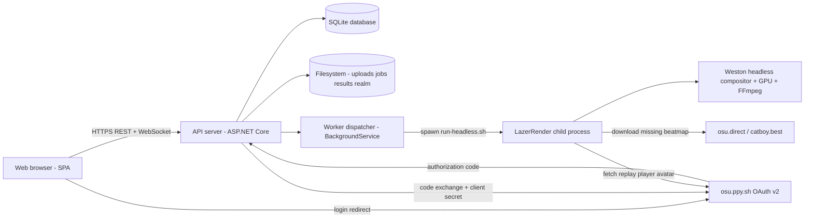
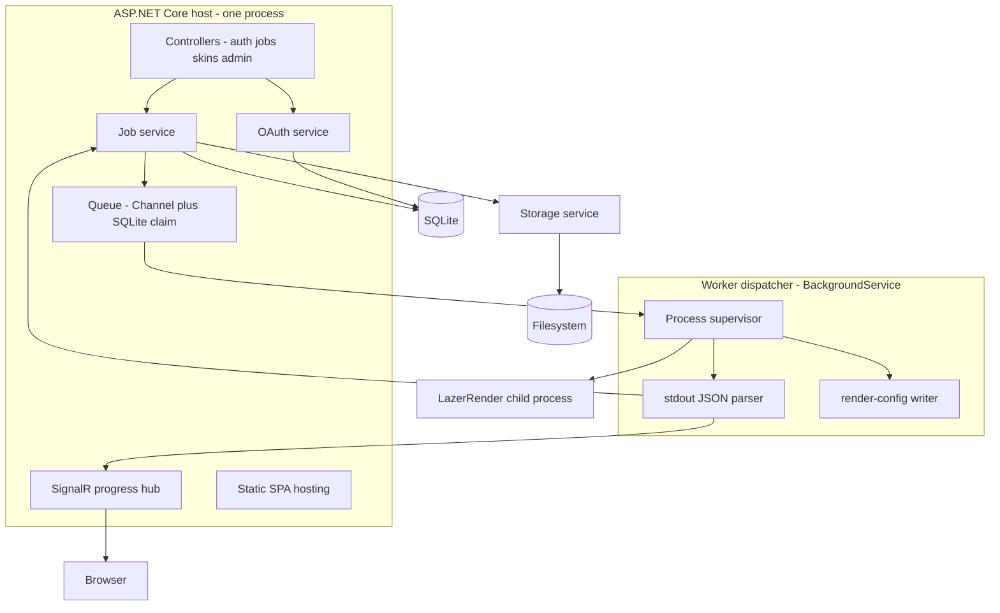
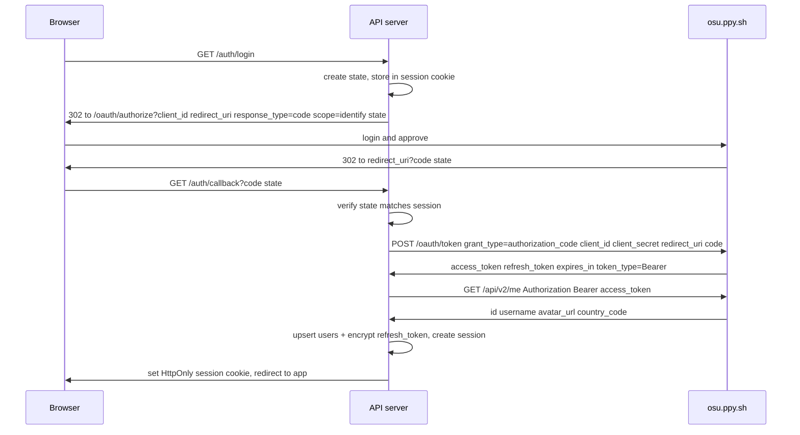
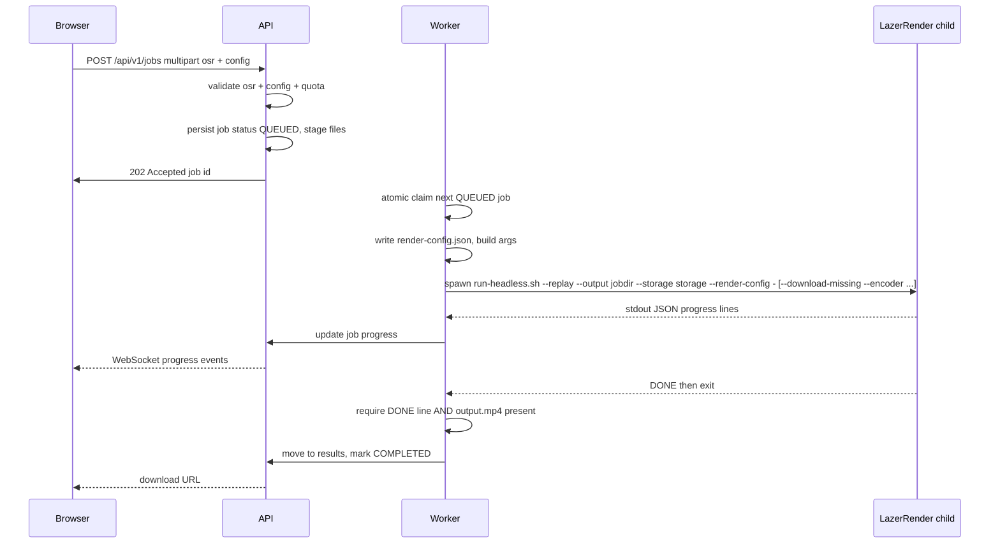
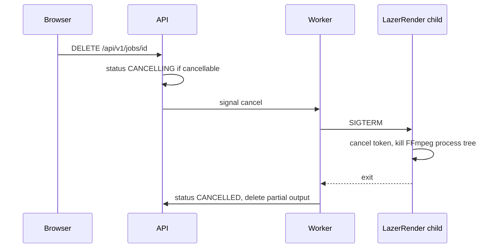
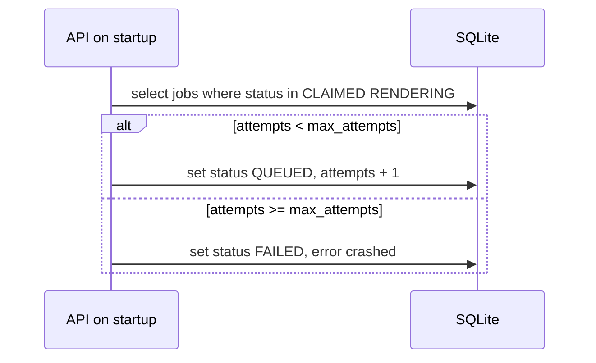

# LazerRender Phase 5 — Web Service Architecture

This document is the complete architecture for turning LazerRender into an o!rdr-like web service.
It is the design contract the implementer (Code mode) will follow. It builds directly on the
integration contract in [`WEB_GUI_GUIDE.md`](../LazerRender.Game/WEB_GUI_GUIDE.md:1) and the internals in
[`ARCHITECTURE.md`](../ARCHITECTURE.md:1).

---

## 0. Guiding decisions (read first)

| Decision | Choice | Rationale |
|---|---|---|
| Deployment model | Public multi-user, single self-hosted server, one GPU | Stated MVP goal |
| Backend stack | **ASP.NET Core (.NET 8)** | Single toolchain with the engine, shared JSON contracts, SignalR, BackgroundService worker |
| Database | **SQLite** (EF Core) | Zero-ops on one server; upgrade path to PostgreSQL is a connection-string change |
| Queue | **In-process `Channel` + DB-backed job table** | Crash recovery and multi-GPU expansion without Redis/RabbitMQ |
| Message broker | **Not needed for MVP** (see §7) | See §7 |
| Frontend | SPA (React/Vite) served as static files by the API | Progress over WebSocket via SignalR |
| Auth | osu! OAuth v2 authorization-code grant, `identify` scope | §6 |
| Renderer concurrency | **Serialized: one active render per worker** | §2 |

---

## 1. System diagram



---

## 2. Component diagram



**One deployment unit.** The API and the worker dispatcher live in the same ASP.NET process. The
heavy, crash-prone work happens in the LazerRender **child process**, so a renderer crash or GPU
segfault does not take down the API. The worker is a [`BackgroundService`] that supervises child
processes; the API only writes job rows and broadcasts progress.

**Serialization guarantee.** A single `SemaphoreSlim(1)` per worker plus an atomic SQLite claim
(`UPDATE jobs SET status='CLAIMED' WHERE id = (SELECT ...) AND status='QUEUED'`) ensures exactly
one active render per worker. Multiple workers (future multi-GPU) each hold their own semaphore and
claim jobs from the same table, so the guarantee holds per GPU.

**Future multi-GPU note.** `FfmpegFrameSink` hardcodes `/dev/dri/renderD128` for VAAPI. Multi-GPU
will require a LazerRender change to parameterize the device node and an encoder/GPU tag on each
worker. This is an extension point, not an MVP requirement.

---

## 3. Job lifecycle

Task C: UPLOAD → VALIDATE → QUEUE → RENDER → FINALIZE → STORE → DELIVER, mapped to a concrete
status enum.

```
UPLOADED → VALIDATING → QUEUED → CLAIMED → RENDERING → FINALIZING → STORED → COMPLETED
                  ↘ REJECTED                                   ↘ FAILED
                                                               ↘ CANCELLING → CANCELLED
```

| Status | Meaning | Who transitions |
|---|---|---|
| `UPLOADED` | Multipart received, bytes staged on disk | API |
| `VALIDATING` | Parsing `.osr` header, checking MD5, validating render config | API |
| `QUEUED` | Ready to render, waiting for a worker | API |
| `CLAIMED` | A worker reserved the job (atomic claim) | Worker |
| `RENDERING` | LazerRender running; sub-phase from stdout JSON | Worker |
| `FINALIZING` | LazerRender emitted `FINALIZING`/`DONE`; FFmpeg finalizing | Worker |
| `STORED` | `output.mp4` verified and moved into the result store | Worker |
| `COMPLETED` | Deliverable available for download | Worker |
| `FAILED` | Validation, render or finalize error | API/Worker |
| `CANCELLING` | User requested cancellation; SIGTERM sent | API |
| `CANCELLED` | Child process exited after cancellation | Worker |
| `REJECTED` | Validation failed before queueing | API |

### Critical supervision rules

1. **Never trust exit code 0 alone.** LazerRender returns `0` from `Main` even when a render fails
   internally (see [`ARCHITECTURE.md`](../ARCHITECTURE.md:141)). Success is only the `DONE`
   progress line on stdout. The worker must require the `DONE` line AND a non-empty `output.mp4`.
2. **Parse stdout line by line.** Ignore non-JSON lines (human logs). The progress schema is:
   `{"type":"progress","phase":"...","frame":N,"total":N|null,"fps":N}` with phase order
   `PARSING → RENDERING_FRAMES → RESULTS_TAIL → FINALIZING → DONE`.
3. **`total` may be `null`.** When no `--duration` is given the frame budget is unbounded; the
   frontend must show frame/fps progress rather than a percentage in that case.
4. **One `--storage` directory per instance.** It accumulates beatmaps/skins/Realm across renders
   and is shared by all jobs. The worker never renders two jobs into the same output directory.

---

## 4. API endpoints

Base path `/api/v1`. Authenticated endpoints require the session cookie (or Bearer JWT if chosen).

### Auth

| Method | Path | Auth | Description |
|---|---|---|---|
| `GET` | `/auth/login` | none | 302 to osu! authorize URL (`scope=identify`) |
| `GET` | `/auth/callback` | none | Exchange `code`, create session |
| `POST` | `/auth/logout` | session | Clear session, revoke local tokens |
| `GET` | `/api/v1/me` | session | Current user + quota usage |

### Jobs

| Method | Path | Auth | Description |
|---|---|---|---|
| `POST` | `/api/v1/jobs` | session | Upload `.osr` + render config → validate → enqueue |
| `GET` | `/api/v1/jobs` | session | List own jobs (paginated, filter by status) |
| `GET` | `/api/v1/jobs/{id}` | owner/admin | Job detail + latest progress |
| `DELETE` | `/api/v1/jobs/{id}` | owner/admin | Request cancellation |
| `GET` | `/api/v1/jobs/{id}/result` | owner/admin | Download `output.mp4` |
| `WS` | `/hubs/jobs?jobId=...` | session | Live progress push (SignalR) |

### Assets

| Method | Path | Auth | Description |
|---|---|---|---|
| `POST` | `/api/v1/skins` | session | Upload `.osk` → import into shared Realm library |
| `GET` | `/api/v1/skins` | session | List available skins (shared library) |
| `POST` | `/api/v1/beatmaps` | session | Upload/import `.osz` (optional; auto-download covers most cases) |
| `GET` | `/api/v1/beatmaps/cache/{md5}` | session | Whether a beatmap hash is already imported |

### Admin

| Method | Path | Auth | Description |
|---|---|---|---|
| `GET` | `/api/v1/admin/queue` | admin | Queue depth, active worker, per-worker state |
| `GET` | `/api/v1/admin/jobs` | admin | All jobs (any owner) |
| `POST` | `/api/v1/admin/jobs/{id}/requeue` | admin | Requeue a FAILED/CANCELLED job |
| `POST` | `/api/v1/admin/skins/purge` | admin | Purge beatmaps/skins (maps to `--purge`) |
| `GET` | `/api/v1/admin/stats` | admin | Storage used, job counts, quota config |

---

## 5. Persistent metadata (SQLite schema)

### `users`

| Column | Type | Notes |
|---|---|---|
| `id` | TEXT PK | Local UUID |
| `osu_user_id` | INTEGER UNIQUE | osu! user id (identity anchor) |
| `username` | TEXT | From `/api/v2/me` |
| `avatar_url` | TEXT | From `/api/v2/me` |
| `country_code` | TEXT | |
| `role` | TEXT | `user` / `admin` |
| `created_at` / `last_login_at` | TEXT | ISO8601 |

### `oauth_tokens`

| Column | Type | Notes |
|---|---|---|
| `user_id` | TEXT PK/FK | |
| `refresh_token_encrypted` | TEXT | ASP.NET Data Protection encrypted |
| `scopes` | TEXT | Granted scopes (for audit) |
| `issued_at` / `expires_at` | TEXT | |

Do **not** persist the user access token long-term; it is short-lived and only used in-memory for
the `/api/v2/me` call during login.

### `jobs`

| Column | Type | Notes |
|---|---|---|
| `id` | TEXT PK | Local UUID |
| `owner_user_id` | TEXT FK | Ownership (history + quotas) |
| `status` | TEXT | Enum from §3 |
| `replay_path` | TEXT | Staged `.osr` |
| `replay_md5` | TEXT | Beatmap hash from `.osr` header |
| `player_username` | TEXT | From `.osr` header (for avatar lookup) |
| `skin_name` | TEXT | Nullable |
| `render_config_json` | TEXT | Validated §schema from [`WEB_GUI_GUIDE.md`](../LazerRender.Game/WEB_GUI_GUIDE.md:84) |
| `encoder` | TEXT | `cpu`/`amd`/`nvidia`/`intel` (server default) |
| `width` / `height` / `fps` | INTEGER | Denormalized for listing |
| `duration` | REAL | Nullable |
| `phase` / `frame` / `total` / `fps_now` | mixed | Latest progress snapshot |
| `attempts` / `max_attempts` | INTEGER | Retry budget |
| `error_message` | TEXT | |
| `output_path` / `result_size` | TEXT/INTEGER | Deliverable |
| `created_at` / `claimed_at` / `started_at` / `finished_at` | TEXT | |

Render history is a **query over `jobs`** filtered by status, not a separate table.

### `skins`

| Column | Type | Notes |
|---|---|---|
| `id` | TEXT PK | |
| `name` | TEXT | Skin name as it appears in Realm |
| `uploaded_by` | TEXT FK | |
| `archive_hash` | TEXT | Dedup |
| `storage_path` | TEXT | |
| `imported_at` | TEXT | |

**Skin isolation caveat.** LazerRender applies skins by name from the single shared Realm DB. True
per-user skin isolation would require per-user `--storage` directories (a future change). MVP:
skins are a shared library; each is imported once and referenced by name.

### `beatmap_cache`

| Column | Type | Notes |
|---|---|---|
| `md5` | TEXT PK | Beatmap hash |
| `imported` | BOOL | Present in Realm |
| `downloaded_at` | TEXT | |

Used to answer `/beatmaps/cache/{md5}` and to skip redundant auto-downloads.

### Result retention

`jobs` rows carry a `retained_until` timestamp. A background sweep deletes results past the
configurable retention window (default, e.g. 7 days) and reclaims the work directory. Raw `.osr`
uploads are deleted after the job reaches a terminal state unless retention is configured to keep
them.

---

## 6. OAuth v2 integration (osu!)

### 6.1 The three distinct auth concerns

| Concern | Grant | Scope | Token used for |
|---|---|---|---|
| **Web user login** | authorization code | `identify` | `GET /api/v2/me` to create/link the local account |
| **osu! API access on the user's behalf** | not needed for MVP | — | We only need identity, so do not request user-delegated scopes |
| **Renderer avatar / API** | client credentials | `public` | `GET /api/v2/users/{username}` inside LazerRender |

These must never be conflated. The renderer's avatar token is a **server-owned** client-credentials
token (already prototyped in [`fetch-bearer-token.sh`](../LazerRender.Game/scripts/fetch-bearer-token.sh:1)),
independent of any logged-in user. Never use a user's personal access token to render another
user's replay avatar.

### 6.2 Login flow (authorization code)



Endpoints and scopes (verify against <https://osu.ppy.sh/docs/> during implementation — the docs are
the source of truth and may change):

- Authorization: `https://osu.ppy.sh/oauth/authorize`
- Token: `https://osu.ppy.sh/oauth/token`
- Scopes required: `identify` (login identity). `public` is for the separate server-side
  client-credentials token. Newer optional scopes (`friends.read`, `chat.write`) are not needed.
- Access-token lifetime is short (documented as 86400 s / 24 h). The refresh token is long-lived and
  revocable. The implementer must read the live `expires_in` from the token response rather than
  hardcoding it.

### 6.3 Refresh-token lifecycle

1. On login, store the refresh token encrypted with ASP.NET Data Protection (key ring persisted to a
   `keys/` directory outside the repo).
2. The API does not normally need the user's access token after login. If a user-delegated scope is
   ever added, a background refresh runs before expiry and re-encrypts the new refresh token.
3. On logout: delete the local session and the stored refresh token. Optionally call the revocation
   endpoint (`DELETE /api/v2/oauth/tokens/current` — confirm path against live docs). Users can also
   revoke the app from their osu! account settings; a refresh failure must therefore degrade
   gracefully to "re-login required", never to an infinite loop.

### 6.4 Security model

- `client_id`/`client_secret` live in server environment variables only (never code, never the SPA).
- `redirect_uri` exact-match allowlist; `state` nonce for CSRF.
- Session: HttpOnly + Secure + `SameSite=Lax` cookie, short sliding lifetime; anti-forgery token for
  state-changing requests (or a Bearer JWT in an HttpOnly cookie if preferred).
- TLS terminated at a reverse proxy (Caddy/nginx) in front of the API.
- Per-user quotas and rate limiting (simple, configurable): max concurrent queued jobs, max jobs per
  rolling 24 h window, max `.osr`/`.osk` upload size, max output duration, max result size.
- Input validation: `.osr` magic/format sanity, render-config validated against the exact schema in
  [`WEB_GUI_GUIDE.md`](../LazerRender.Game/WEB_GUI_GUIDE.md:84), filenames/paths generated server-side (no user
  paths) to prevent traversal.
- CORS restricted to the SPA origin.

---

## 7. Is Redis/RabbitMQ needed? — No, for MVP

| Concern | MVP solution | When a broker becomes worth it |
|---|---|---|
| Job queue | SQLite job rows + `Channel`/semaphore dispatch | Multi-host deployments needing cross-host claims |
| Crash recovery | Startup sweep resets `CLAIMED`/`RENDERING` to `QUEUED` | Same as above |
| Progress fan-out | In-process SignalR hub | Multi-node horizontal scaling |
| Worker scale-out | More worker processes on the same host, DB-atomic claim | Cross-host worker pools |

The MVP is one server, one process, one GPU. A DB-backed queue with atomic claim gives the two
things that actually matter at this scale — **durability** (jobs survive restarts) and **safe
recovery** (stale jobs are requeued) — without operating Redis. Introduce Redis only if the service
grows to multiple hosts; keep the queue behind a `IJobQueue` abstraction so that swap is contained.

---

## 8. Render sequence



The worker builds one invocation per the recipe in [`WEB_GUI_GUIDE.md`](../LazerRender.Game/WEB_GUI_GUIDE.md:232):
`--replay <staged.osr> --output <jobdir> --storage <storage> --render-config -`
(`--download-missing` enabled for unattended map resolution, `--encoder` from server config).

---

## 9. Cancellation sequence



---

## 10. Failure recovery sequence



Retries use capped `max_attempts` (default 3). Validation failures (`REJECTED`) and user
cancellations are not retried. The sweep also handles: `CANCELLING` jobs whose process is gone →
`CANCELLED`; `FINALIZING` jobs without a `DONE` line → `FAILED`.

---

## 11. Tech stack comparison

| Criterion | ASP.NET Core (.NET 8) | Node.js (Fastify/NestJS) | Python (FastAPI) |
|---|---|---|---|
| Same toolchain as engine | **Yes** (one `dotnet` runtime) | No | No |
| Shared JSON contracts | **Yes** (class library + `System.Text.Json`) | Partial (types duplicated) | Partial (pydantic re-typed) |
| Worker supervision | `BackgroundService` + `Process` | Good | Good |
| Realtime progress | **SignalR** (built-in, same process) | Socket.IO (good) | WebSocket (good) |
| Storage | EF Core + SQLite | Prisma/Drizzle + SQLite | SQLAlchemy + SQLite |
| OAuth | Hand-rolled handler or AspNet.Security providers | `passport`/`grant` | `authlib` (good) |
| Ops footprint | One runtime | Node runtime + .NET (engine) | Python + .NET (engine) |
| Team familiarity | C# (engine is C#) | Depends | Depends |

**Recommendation: ASP.NET Core (.NET 8).** The decisive factors are: the engine already runs on
.NET 8 so a single `dotnet` toolchain deploys everything; the render-config and progress JSON
contracts can be a shared class library referenced by both the API and (optionally) future
LazerRender changes; SignalR provides in-process WebSocket progress with zero extra services; EF
Core + SQLite is a zero-ops database on one server. FastAPI would be a reasonable second choice if
the team were Python-first, but it introduces a third ecosystem next to the C# engine and requires
re-typing the contracts.

---

## 12. Implementation order

1. **Scaffold + contracts** — solution, ASP.NET project, shared contracts project (render-config +
   progress DTOs + encoder enum), config, logging, SPA skeleton.
2. **Storage + DB** — EF Core SQLite, migrations for §5 schema, filesystem layout, config model.
3. **OAuth** — login flow, session, `users`/`oauth_tokens`, `/api/v1/me`.
4. **Job submission + validation** — upload, `.osr` header parse, config validation, quotas, job row.
5. **Worker + queue** — BackgroundService, atomic claim, spawn `run-headless.sh`, stdout parser,
   SignalR hub, progress persistence.
6. **Cancellation + recovery + retries** — cancel flow, startup requeue, attempt limits, result
   verification and move.
7. **Delivery + history + assets** — download endpoint, history listing, skin upload/admin,
   retention sweep.
8. **Frontend SPA** — login, render form, queue view, live progress, history, admin.
9. **Hardening** — TLS reverse proxy, rate limiting, quotas tuning, backup, invite-only toggle,
   docs.

Each item maps 1:1 to a todo-list entry below.
