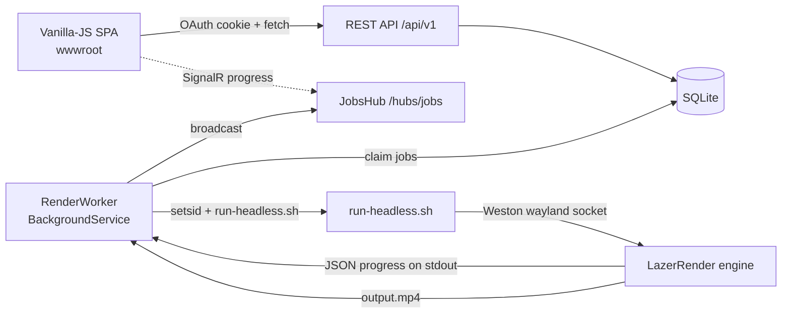

# MAINTENANCE_INFRA_CONTEXT.md

**Purpose.** This document is the map and raw material for designing LazerRender's maintenance and
observability infrastructure (Roadmap Phase 8: §8.2 logging & instrumentation core, §8.3 admin
observability panel, §8.4 `MAINTENANCE.md` + debug workflow docs). It is written to be read **instead
of** cloning and re-deriving the architecture.

**Audience.** A skilled engineer who has never seen this repo. Prioritise file paths, code excerpts and
concrete fragility points over general explanation. Where something is unverified, it is marked as such.

**Repo root (project-relative, as referenced throughout):** `lazer-render/`

**Baseline.** Line numbers, paths and code excerpts refer to commit `28072c17` ("Initial commit:
LazerRender headless replay recorder and web service", 106 files). Runtime data (`storage/`, `data/`,
`keys/`), build output, editor config and the private `dev/` notes are gitignored and are not part of the
tracked tree.

**Current state of `MAINTENANCE.md`** — it exists and is a one-line placeholder:

```markdown
*for future document documenting routine workflow for bumping osu version, as well as finding and fixing bugs*
```

So there is **no** existing maintenance workflow to preserve; this is greenfield.

**Status addendum (Phase 8.2 implemented).** The logging/instrumentation core this document describes as
greenfield now exists: `LazerRender.Service/src/LazerRender.Api/Services/Logging/` (the `ILogSink`
contract, the two bounded ring buffers, `LogRedactor`, `RingBufferLoggerProvider`, `EngineLogForwarder`,
`DebugMode`), the shared `LogRecord` model in `LazerRender.Contracts`, the repository-root
`Directory.Build.props` (`LAZERRENDER_DEBUG`) and `LazerRender.Game/DebugInstrumentation.cs`. See
[`PHASE_8_LOGGING_CONTEXT.md`](PHASE_8_LOGGING_CONTEXT.md:1) for the interfaces the remaining 8.3/8.4
work consumes. The fragility inventory in §5 and the dependency notes in §8 below are still the
maintenance baseline.

---

## 1. Architecture overview

### 1.1 Repository layout (with responsibilities)

```
lazer-render/
├── README.md                     user-facing overview
├── ROADMAP.md                    phased plan (Phases 8.2-8.4 are this task)
├── ARCHITECTURE.md               the authoritative deep-dive (Part 2 engine, Part 3 service)
├── MAINTENANCE.md                placeholder (the deliverable)
├── SECURITY_AUDIT_CONTEXT.md     sibling briefing (Phase 7 audit)
├── MAINTENANCE_INFRA_CONTEXT.md  this document (Phase 8 design input)
├── .gitignore                    excludes runtime data, dev/ notes, editor config
├── LazerRender.sln               ENGINE solution (references LazerRender.Game)
├── .gitmodules                   pins LazerRender.Game/extern/osu
│
├── LazerRender.Game/             ── THE ENGINE (headless recorder) ──
│   ├── LazerRender.Game.csproj   net8.0, AssemblyName=LazerRender, no NuGet refs of its own
│   ├── Program.cs                CLI entry: parse args → printUsage / RunMode dispatch
│   ├── RecordOptions.cs          the CLI options model (RunMode, HudComponents, tokens, ...)
│   ├── SettingDescriptor.cs      SettingDescriptor + SettingsCatalog + SettingsEngine
│   ├── LazerRenderGame.cs        OsuGameBase subclass: orchestration, API login, avatars, mirrors
│   ├── LazerRenderGameHost.cs    owns the real SDL desktop host + manual clock
│   ├── ReplayRecorderPlayer.cs   the record loop (manual clock, frame capture, tail fade)
│   ├── CaptureContainer.cs       FBO capture + async PBO readback
│   ├── FrameSink.cs              FfmpegFrameSink: pipes frames+audio into FFmpeg
│   ├── BassTrackDecoder.cs       offline BASS audio decode
│   ├── HitsoundMixer.cs          intercepts lazer's audio mixer for hitsounds (REFLECTION)
│   ├── ExtendedResultsScreen.cs  SoloResultsScreen subclass for recording (REFLECTION)
│   ├── HudVisibilityFilter.cs    HUD whitelist by component type (TYPE-NAME MATCHING)
│   ├── LeaderboardScope.cs       maps our scope string → BeatmapLeaderboardScope
│   ├── RenderState.cs            shared cancellation token
│   ├── WEB_GUI_GUIDE.md          the --render-config schema guide
│   ├── scripts/
│   │   ├── run-headless.sh       Weston headless compositor + dotnet run  ← the service's entry point
│   │   ├── fetch-bearer-token.sh OAuth client-credentials helper
│   │   └── fetch-user-token.sh   OAuth authorization-code helper
│   ├── tests/*.osr               sample replays (11 files: nm/dt/ht/nightcore/long/short/daycore)
│   ├── storage/                  runtime Realm DB + engine files (gitignored)
│   └── extern/osu/               GIT SUBMODULE, pinned 2026.821.0-tachyon (DO NOT EDIT)
│
├── LazerRender.Service/          ── THE WEB SERVICE ──
│   ├── LazerRender.Service.sln
│   ├── DEPLOYMENT.md             deployment notes
│   ├── DESIGN_PLAN.md            service design
│   ├── deploy/                   Caddyfile + lazerrender.service (systemd)
│   ├── scripts/publish-service.sh
│   ├── src/
│   │   ├── LazerRender.Contracts/    shared DTOs + RenderConfig (mirrors WEB_GUI_GUIDE.md)
│   │   └── LazerRender.Api/          ASP.NET Core 8
│   │       ├── Program.cs            composition root (middleware order, DI, auth, rate limits)
│   │       ├── Controllers/          Auth, Me, Jobs, Assets, Admin, Meta, Presets
│   │       ├── Hubs/JobsHub.cs        SignalR progress hub
│   │       ├── Services/              Worker + runner + auth + quota + storage + metadata ...
│   │       ├── Data/                  EF Core SQLite (AppDbContext, Entities, DatabaseInitializer)
│   │       ├── Configuration/         StorageOptions, RendererOptions, QuotaOptions, AdminOptions, OsuOAuthOptions
│   │       ├── wwwroot/               SPA: index.html, app.js, styles.css (NO BUILD STEP)
│   │       └── appsettings.json / appsettings.Development.json / Properties/launchSettings.json
│   └── tests/LazerRender.Worker.Tests/   xunit (32 tests currently passing)
└── (gitignored) storage/, data/, keys/, dev/, .zed/, bin/, obj/, out/, *.log, LazerRender.Service/publish/
```

### 1.2 How the halves relate



The single cross-boundary dependency is `LazerRender.Game/scripts/run-headless.sh`. The contract is:

1. **CLI surface** — verbs `--replay`, `--import-map`, `--import-skin`, `--purge`, `--map-info`,
   `--replay-info`, plus render options and per-render settings. The service reuses these verbs directly.
2. **stdout supervisor contract** — line-delimited JSON progress lines
   (`PARSING → RENDERING_FRAMES → RESULTS_TAIL → FINALIZING → DONE`) plus SIGINT/SIGTERM abort.

The service's `RendererProcessRunner` spawns the engine under `setsid`, passes
`--replay --output --storage --render-config --encoder` (+ tokens), parses stdout, and maps it to job
rows + SignalR events. `ARCHITECTURE.md` Parts 2 and 3 walk every file; treat it as the primary
reference and use this document for the maintenance-specific view.

### 1.3 Key engine ↔ service coupling points (for maintenance triage)

| Concern | Service side | Engine side |
| --- | --- | --- |
| Render config JSON | `LazerRender.Contracts/RenderConfig.cs`, validated by `RenderConfigValidator.cs` | `Program.applyRenderConfig`, `SettingDescriptor.cs`, `HudVisibilityFilter.cs` |
| HUD whitelist vocabulary | `RenderConfigValidator.HudComponentKeys` (hard-coded list) | `HudVisibilityFilter.AllKeys` (hard-coded list) — **must be kept in sync** |
| Leaderboard scope values | `RenderConfigValidator.LeaderboardScopeValues` | `LeaderboardScope.cs` (`LeaderboardScopes`) — **must be kept in sync** |
| Progress | `RendererProcessRunner.TryParseProgress` | `ReplayRecorderPlayer.reportProgress` |
| Cancel | `JobCancellationService` → `CancellationToken` → SIGTERM/SIGKILL | `Program.cs` `PosixSignalRegistration` → `RenderState.CancellationToken` |
| Map metadata | `MapMetadataService` parses `--map-info` JSON stdout | `LazerRenderGame.mapInfoAsync` |
| Encoder | `EncoderResolver` probes FFmpeg | `FrameSink` builds FFmpeg args |
| Assets | `AssetImportRunner` (`--import-skin/-map/-purge`) | `LazerRenderGame.importSkinAsync/importBeatmapAsync/purgeAsync` |

---

## 2. The "tachyon" dependency surface

### 2.1 What is pinned, and where

"Tachyon" is the `ppy/osu` release train. LazerRender tracks a specific release tag of the real osu!lazer
source as a **git submodule**, not a NuGet package.

| Pin | File | Value |
| --- | --- | --- |
| Submodule URL | `.gitmodules` | `https://github.com/ppy/osu.git` |
| Submodule path | `.gitmodules` | `LazerRender.Game/extern/osu` |
| Commit | gitlink | `e9451fe70b91292c482bab203ea87bd727eaa237` |
| Tag | submodule checkout | `2026.821.0-tachyon` |
| SDK | `LazerRender.Game/extern/osu/global.json` | `8.0.100`, `rollForward: latestFeature`, `allowPrerelease: false` |
| Project refs | `LazerRender.Game/LazerRender.Game.csproj` | 5 projects inside the submodule (see below) |

`.gitmodules`:

```
[submodule "LazerRender.Game/extern/osu"]
	path = LazerRender.Game/extern/osu
	url = https://github.com/ppy/osu.git
```

`LazerRender.Game/LazerRender.Game.csproj`:

```xml
<!--
  The official client is pinned to a specific release commit so that APIs do not
  churn underneath us. The pin is recorded by the super-project's submodule
  gitlink (LazerRender.Game/extern/osu), currently 2026.821.0-tachyon.
-->
<ProjectReference Include="extern/osu/osu.Game/osu.Game.csproj" />
<ProjectReference Include="extern/osu/osu.Game.Rulesets.Osu/osu.Game.Rulesets.Osu.csproj" />
<ProjectReference Include="extern/osu/osu.Game.Rulesets.Catch/osu.Game.Rulesets.Catch.csproj" />
<ProjectReference Include="extern/osu/osu.Game.Rulesets.Mania/osu.Game.Rulesets.Mania.csproj" />
<ProjectReference Include="extern/osu/osu.Game.Rulesets.Taiko/osu.Game.Rulesets.Taiko.csproj" />
```

`extern/**` is excluded from the engine's default compile globs:

```xml
<Compile Remove="extern/**" />
<EmbeddedResource Remove="extern/**" />
<None Remove="extern/**;storage/**;tests/**;out/**" />
```

LazerRender does **not** reference `osu.Desktop` (the desktop launcher); it references `osu.Game` plus
the four rulesets and provides its own host (`LazerRenderGameHost.cs`).

### 2.2 How LazerRender couples to tachyon internals

Three distinct coupling classes, in increasing order of surprise:

**(A) Compile-time references** — break the **build** loudly; easy to fix.
Examples: `OsuGameBase`, `OsuConfigManager`/`OsuSetting`, `OsuRulesetConfigManager`/`OsuRulesetSetting`,
`HUDVisibilityMode`, `BeatmapLeaderboardScope`, `SoloResultsScreen`, `ScorePanel`, `SkinnableContainer`,
`GlobalSkinnableContainers`, `HealthDisplay`, `GameplayScoreCounter`, `HitErrorMeter`, `AimErrorMeter`,
`KeyCounterDisplay`, `GameplayAccuracyCounter`, `ModDisplay`, `HoldForMenuButton`, `FailingLayer`,
`BeatmapManager`/`SkinManager`/`ImportTask`, `OnlineAssetCachingStore`, `APIUser`, `LeaderboardManager`,
`LeaderboardCriteria`, `LeaderboardScores`, `LeaderboardFailState`, `GameplayClockContainer`,
`FramedBeatmapClock`, `InterpolatingFramedClock`, `AdjustableManualClock`, `IRenderer`,
`IFrameBuffer`, `Host.GetSuitableDesktopHost`, `HostOptions`.

**(B) Reflection into private/internal members** — break **silently**. This is the maintenance hazard.
Every such site is coded defensively (null-checked, logs a warning, degrades) so a rebase may not fail
the build *or* the render — the feature just stops working. Full inventory in §5, items 1–9.

**(C) Hard-coded type-name / heuristic matching** — breaks **silently**. `HudVisibilityFilter.matches`
switches on our own key strings and matches lazer component types; if lazer renames, merges or
re-parents a HUD component, the wrong thing is hidden or the component leaks into the capture.

### 2.3 Historical breakages and the patterns behind them

What has actually bitten this project (useful as the seed of a "what to watch for" checklist):

1. **`UseDevelopmentServer` / debug-build endpoint selection.** Lazer's `DebugUtils.IsDebugBuild` makes a
   debug build of the game default to the **development** osu! servers (`dev.ppy.sh`), where a
   production user token 401s. The leaderboard then fails with `NotLoggedIn`/`NetworkFailure`. Fixed by
   hard-pinning the production endpoint in the engine:

   ```csharp
   /// <summary>
   /// ... the renderer is a one-shot local
   /// test harness, so the development endpoints are never appropriate.
   /// </summary>
   public override bool UseDevelopmentServer => false;
   ```

   *Pattern:* an override of a virtual property that exists purely to defeat a debug-only heuristic.
   After a rebase, verify the property still exists and is still honoured.

2. **Reflection target drift in the audio path.** `HitsoundMixer` reaches into
   `AudioManager.SampleMixer`, its `Handle` property/backing field, and `AudioManager.ActiveMixers`/its
   `activeMixers` field. A rename of any of these makes `IsAvailable` false and hitsounds silently fall
   back to the default path. *Pattern:* auto-properties compiled to backing fields with
   `<Name>k__BackingField` — verify the compiler still emits the same name shape.

3. **Reflection target drift in the clock path.** `ReplayRecorderPlayer.attachGameplayClockToManualClock`
   reads `GameplayClockContainer.GameplayClock` and `FramedBeatmapClock.interpolatedTrack`. If either
   moves, the recorder logs "could not locate FramedBeatmapClock" and gameplay is no longer driven by the
   manual clock — which silently breaks deterministic rendering. *Pattern:* private field access with a
   graceful warning, so the failure is a log line, not a crash.

4. **Private texture-upload-queue accounting** (`IRenderer.textureUploadQueue` → `Count`) is used to pace
   the record loop. Missing target ⇒ `getPendingTextureUploadCount()` returns null and the loop keeps
   running with a less safe pacing rule.

5. **`ScorePanel.displayWithFlair`** (private) is set to `false` so the results screen does not animate.
   If the field is renamed, the flair animation silently returns.

6. **`CompositeDrawable.InternalChildren`** is reflected in two places (`ExtendedResultsScreen.children`,
   `HudVisibilityFilter.children`) to walk the drawable tree. If it becomes truly private-only or is
   renamed, HUD filtering and results-screen surgery stop finding components.

7. **`VerticalSync`/`AllowTearing`** on the renderer are read (non-public) for a one-shot diagnostic log
   in `CaptureContainer`. Benign if it breaks (the log just omits the swap state).

8. **The online-leaderboard fetch shape.** `warmLeaderboardAsync` calls
   `LeaderboardManager.FetchWithCriteria(criteria, forceRefresh: true)` on the scheduler and polls
   `LeaderboardManager.Scores.Value` for up to 8 s, reading `.FailState`, `.AllScores`, `.TotalScores`.
   Signatures/semantics here are exactly the kind of thing tachyon can change (and the login-gating rules
   have moved before). The engine logs a diagnosis for each fail state.

9. **HUD component type matching.** `HudVisibilityFilter.matches` matches by base type with deliberate
   exclusions (`ComboCounter and not LongestComboCounter`, `HitErrorMeter and not AimErrorMeter`). If
   lazer re-parents these (e.g. makes `AimErrorMeter` no longer derive from `HitErrorMeter`), the
   exclusion logic becomes wrong.

10. **`OsuSetting` enum members** used by the settings catalog (`OsuSetting.DimLevel`, `BlurLevel`,
    `MenuParallaxScale`, `ShowStoryboard`, `PreferNoVideo`, `BeatmapSkins`, `BeatmapColours`,
    `ComboColourNormalisationAmount`, `BeatmapHitsounds`, `GameplayCursorSize`, `HUDVisibilityMode`,
    `HitLighting`, plus ruleset settings and `Token`/`SavePassword`). These are compile-time, so a rename
    breaks the build — but the **semantics/inversion** can change silently (e.g. `PreferNoVideo` is
    handled with an explicit `inverted: true` flag in `SettingsCatalog`).

11. **`InternalChildren`-based HUD container discovery** relies on `SkinnableContainer` +
    `GlobalSkinnableContainers.MainHUDComponents`. If HUD composition moves out of skinnable containers,
    the "fixed controls" branch (`FailingLayer`, `HoldForMenuButton`, `ModDisplay`) is what remains.

12. **`DrawableAvatar` online-id rule.** `LazerRenderGame.applyAvatarAsync` carries a comment that
    `DrawableAvatar` refuses to load a remote avatar unless `user.OnlineID > 1`. If that threshold or the
    lookup path changes, avatars silently fall back to the guest placeholder.

13. **`OnlineAssetCachingStore` pre-warming.** `preWarmAvatar` resolves
    `Dependencies.Get<OnlineAssetCachingStore>().Get(url)`. If avatar loading moves to a different store,
    the pre-warm no-ops and the results screen may do a remote fetch under texture load (historically a
    crash).

14. **`Configuration.ShowLeaderboard` / `ShowFailingOverlay`** are set in the `ReplayRecorderPlayer`
    constructor to make the scoreboard element behave when the recorder bypasses PlayerLoader.

15. **`PosixSignalRegistration` / manual-clock mechanics** are framework-level, not lazer-level, but a
    `ppy.osu.Framework` bump (which arrives with tachyon) can change them.

**Cross-cutting pattern:** everything in class (B)/(C) fails *quietly by design*. A tachyon rebase
workflow must therefore include a **functional smoke test per feature**, not just a build. The engine's
own log already emits a distinct warning for each degraded path — that is the raw material for a
maintenance checklist.

**External-API pattern (not tachyon, but the same class of fragility in the same files):** two public
beatmap mirrors are parsed by JSON key — `beatmapset_id` from `osu.direct/api/v2/md5/{hash}` and
`ParentSetID` from `catboy.best/api/md5/{hash}`. A mirror can change its payload shape without any
tachyon release. `LazerRenderGame.downloadBeatmapAsync` logs each mirror failure and throws only when
both fail.

---

## 3. Current build system and where a debug flag could go

### 3.1 What exists today

- **Engine** (`LazerRender.Game/LazerRender.Game.csproj`): SDK `Microsoft.NET.Sdk`, `net8.0`,
  `LangVersion 12.0`, `Nullable enable`, `ImplicitUsings disable`, `AllowUnsafeBlocks true`,
  `AssemblyName LazerRender`, `RootNamespace LazerRender`, `Version 0.1.0`. **No `PackageReference`s.**
  No `<PropertyGroup Condition="...">` configuration-specific settings of its own.
- **Service** (`.../LazerRender.Api/LazerRender.Api.csproj`): `Microsoft.NET.Sdk.Web`, `net8.0`,
  `Nullable enable`, `ImplicitUsings enable`, 3 `PackageReference`s, one `InternalsVisibleTo`
  (`LazerRender.Worker.Tests`), and a content rule that keeps dev settings out of published output:

  ```xml
  <ItemGroup>
    <!-- Development-only settings must never ship with a published bundle. -->
    <Content Update="appsettings.Development.json">
      <CopyToPublishDirectory>Never</CopyToPublishDirectory>
    </Content>
  </ItemGroup>
  ```

- **Contracts**: plain library, no refs. **Tests**: xunit runner + EF Core Sqlite.
- **There is no `Directory.Build.props`, `Directory.Packages.props`, `nuget.config` or
  `packages.lock.json` anywhere in the repository.**
- **`dotnet run` means Debug.** `LazerRender.Game/scripts/run-headless.sh` (the path the *service*
  spawns) ends with:

  ```bash
  WAYLAND_DISPLAY="$SOCKET" dotnet run --project "$(dirname "$0")/../LazerRender.Game.csproj" -- "$@"
  ```

  So the production render path currently builds and runs the engine in **Debug** configuration
  regardless of how the service was published. That is important: any "debug-only, compiled out of
  release" scheme will not be compiled out on the render host unless the runner script is also taught to
  build/run Release (or a prebuilt Release binary is used).

- **Service dev/release signals:** `Properties/launchSettings.json` defines a single `http` profile with
  `applicationUrl: http://localhost:5080` and `ASPNETCORE_ENVIRONMENT=Development`. Production uses
  `scripts/publish-service.sh` (self-contained `linux-x64`) and/or `deploy/lazerrender.service` (systemd)
  + `deploy/Caddyfile`. `Program.cs` gates Swagger on `app.Environment.IsDevelopment()`.

- **The submodule already does configuration-conditional compilation** in
  `LazerRender.Game/extern/osu/Directory.Build.props`:

  ```xml
  <!-- Stabilises hot reload, ... -->
  <GenerateAssemblyInfo Condition="'$(Configuration)'=='Debug'">false</GenerateAssemblyInfo>
  <!-- Required due to the above -->
  <NoWarn Condition="'$(Configuration)'=='Debug'">$(NoWarn);CA1416</NoWarn>
  ```

  and unconditionally `<NoWarn>$(NoWarn);CS1591</NoWarn>` (documentation warnings).

### 3.2 Important MSBuild nuance for where a flag can be inserted

MSBuild resolves `Directory.Build.props` by walking **up** from the project directory and **stopping at
the first one found**. Therefore:

- A **new `Directory.Build.props` at the repo root** would apply to `LazerRender.Game`,
  `LazerRender.Contracts`, `LazerRender.Api` and `LazerRender.Worker.Tests` (none of those directories has
  a closer one).
- It would **NOT** apply to the submodule projects, because `LazerRender.Game/extern/osu/` has its own
  `Directory.Build.props`, which wins. To define a constant for the submodule projects you would have to
  either edit inside `extern/` (**not allowed** — it is a pinned submodule) or inject it from the command
  line (`-p:DefineConstants=...`), which is global and therefore affects upstream code too.

This means a repo-level debug flag can cleanly instrument **our** code but cannot reach lazer internals
without side effects.

### 3.3 Realistic insertion points, by language/platform

| Layer | Mechanism | Where | Notes |
| --- | --- | --- | --- |
| C# (ours) | `DefineConstants` + `#if` / `[Conditional]` | new root `Directory.Build.props`, e.g. `<DefineConstants Condition="'$(Configuration)'=='Debug'">$(DefineConstants);LAZERRENDER_DEBUG</DefineConstants>` | Applies to engine + service + tests. No source change needed beyond the attribute. |
| C# (ours), finer control | a dedicated property, e.g. `-p:LazerRenderDebug=true` / `LAZERRENDER_DEBUG` MSBuild property | root props | Lets a Release binary carry debug logging when a maintainer explicitly asks. |
| C# (runtime, engine) | environment variables | engine already does this: `LAZERRENDER_FLATFILL=1` (`LazerRenderGame.cs`), `LAZERRENDER_MESA_DRIVER` (`run-headless.sh`) | Cheapest to add; no rebuild; **not** compiled out, so must be named clearly as diagnostic. |
| C# (runtime, service) | `ASPNETCORE_ENVIRONMENT` + `appsettings.{Environment}.json` + `Logging:LogLevel` | `appsettings.json`, `appsettings.Development.json` | Already the standard mechanism; dev file is excluded from publish. |
| Bash | guarded `set -x` / explicit echoes | `LazerRender.Game/scripts/run-headless.sh` | e.g. `[[ -n "${LAZERRENDER_DEBUG:-}" ]] && set -x`; also where you would switch `dotnet run` → prebuilt Release. |
| JS | runtime global / query param | `wwwroot/index.html`, `wwwroot/app.js` | **No build step**, so nothing is "compiled out". Must be gated server-side (only served when the service is in Development) or it ships to production. |
| MSBuild/CI | `-c Release` | publish path | `publish-service.sh`; the engine runner script currently ignores it. |

**Recommended shape (for you to design, not prescribed):** one compile-time constant
(`LAZERRENDER_DEBUG`, sourced from `$(Configuration) == 'Debug'`) governing `[Conditional]`-style
instrumentation in our C# code, plus one runtime env var (`LAZERRENDER_DEBUG=1`) for the paths that must
be toggleable without a rebuild, plus a decision about whether the render host should actually run a
Release engine binary (currently it does not).

---

## 4. The admin control panel (current capabilities — the basis for Phase 8.3)

> **Phase 8.3 implemented.** The panel is now split into Users, Library, Render PC and Console logs;
> the logging surfaces described below as missing exist as `LogStreamService` + the
> `GET/POST /api/v1/admin/logs*` endpoints and `SystemInfoService` for the Render PC card. See
> [`PHASE_8_3_CONTEXT.md`](PHASE_8_3_CONTEXT.md:1). Everything below describes the pre-8.3 state and is
> retained as the historical basis for the design.

### 4.1 Where it lives

**Frontend:** `LazerRender.Service/src/LazerRender.Api/wwwroot/index.html` (markup),
`.../wwwroot/app.js` (logic), `.../wwwroot/styles.css`. The Admin tab is `#tab-admin` (a `.tab-panel`
inside `#app`) and its nav button is `#admin-tab`, revealed only for admins:

```javascript
if (me.role === "admin") { $("admin-tab").hidden = false; initAdmin(); }
```

```javascript
document.querySelectorAll(".tab").forEach((t) => t.classList.toggle("active", t.dataset.tab === name));
```

**Backend:** `LazerRender.Service/src/LazerRender.Api/Controllers/AdminController.cs`
(`[Route("/api/v1/admin")]`, `[Authorize(Roles = "admin")]`) and
`.../Controllers/MetaController.cs` (the encoder readout).

### 4.2 What it actually does today

Cards inside `#tab-admin`:

1. **Queue stats** — `#queue-stats`, filled by `GET /api/v1/admin/queue`:

   ```csharp
   var queued = await db.Jobs.CountAsync(j => j.Status == JobStatus.Queued, ct);
   var active = await db.Jobs.CountAsync(j =>
       j.Status == JobStatus.Claimed ||
       j.Status == JobStatus.Rendering ||
       j.Status == JobStatus.Finalizing, ct);
   return Ok(new { queued, active });
   ```

   Rendered as `Active: {active} · Queued: {queued}`.

2. **Users** — `GET /api/v1/admin/users`, `POST /api/v1/admin/users/allow`,
   `POST /api/v1/admin/users/revoke`; the SPA renders a table with Allow/Revoke buttons. `AllowUser`
   accepts either `osuUserId` or `username` (resolving a username requires `Renderer:AvatarApiKey` or
   `OSU_API_KEY`).

3. **Library** — buttons calling `POST /api/v1/admin/purge?target=beatmaps|skins|all`, which runs the
   engine `--purge` through `AssetImportRunner` behind the shared render lock.

4. **Render PC** — currently **only** the encoder readout:

   ```html
   <section class="card">
     <h2>Render PC</h2>
     <p id="encoder-info" class="muted">Detecting encoder…</p>
   </section>
   ```

   filled by `loadCapabilities()` from `GET /api/v1/capabilities`:

   ```javascript
   const caps = await api("/api/v1/capabilities");
   $("encoder-info").textContent = `Encoder: ${caps.encoder.toUpperCase()}${caps.autoDetected ? " (auto-detected)" : ""}`;
   ```

   `MetaController.Capabilities` returns `{ encoder, autoDetected }` from `EncoderResolver`.
   This is the anchor for Roadmap §8.3's planned CPU/GPU/RAM/FFmpeg/runtime summary.

The admin panel is refreshed on a timer (`state.adminTimer`, every 15 s) and on tab init.

### 4.3 Does it have a logging/monitoring surface a debug output could hook into?

> **Phase 8.3 update.** It now does: the two ring buffers (Phase 8.2) are read through
> `LogStreamService`, and the panel polls them only while open. The console-log streaming is a
> pull model, not SignalR (see [`PHASE_8_3_CONTEXT.md`](PHASE_8_3_CONTEXT.md:1)).

**No — and this is an explicit flag for you.**

- There is **no** console-logs panel, no log streaming endpoint, no in-memory log ring buffer, no log
  file for the service, and no SignalR channel for log lines.
- The only "monitoring" surfaces that exist are: the SignalR **render progress** broadcast
  (`JobsHub.progress`), the queue-count endpoint above, and `/health`.
- The service logs exclusively through `ILogger<T>` to the console (stdout/stderr of the process). There
  is no persistence.
- The engine's stdout/stderr **is already captured** by `RendererProcessRunner` and classified — see
  §6.3 — but it is only forwarded to the service's `ILogger` and then discarded.

So the §8.2 debug workflow and the §8.3 console-logs panel both start from zero UI-wise, but the
**classification logic already exists and should be reused** (Roadmap §8.2 and §8.3 both say so).
`RendererProcessRunner.logEngineLine` is the natural single choke point for a tee/ring-buffer.

---

## 5. Top fragility points for a tachyon rebase

Ordered roughly by risk (silent failure × importance to correctness). Line numbers are from the current
tree and will drift.

| # | File | What is fragile | Why |
| --- | --- | --- | --- |
| 1 | `LazerRender.Game/HitsoundMixer.cs:49-69` | Reflection: `SampleMixer.GetType().GetProperty("Handle")`, `GetField("<Handle>k__BackingField")`, `typeof(AudioManager).GetProperty("ActiveMixers")`, `GetField("activeMixers")` | Any rename ⇒ `IsAvailable` false ⇒ hitsounds silently do not mix. Compiler-generated backing-field naming is an implementation detail. |
| 2 | `LazerRender.Game/HudVisibilityFilter.cs:168-245` (`matches`) | Type matching for 22 HUD keys incl. `ArgonWedgePiece`, `BigBlackBox`, `BoxElement`, `TextElement`, `BeatmapAttributeText`, `SkinnableSprite`, `DrawableGameplayLeaderboard`, `BarHitErrorMeter`, `AimErrorMeter`, `Argon*` counters | Lazer renames/merges/re-parents components between releases; the switch then hides the wrong element or lets one leak. Explicit base-type exclusions (`HitErrorMeter and not AimErrorMeter`) are assumptions that can invert. |
| 3 | `LazerRender.Game/ReplayRecorderPlayer.cs:287-306` (`attachGameplayClockToManualClock`) | `typeof(GameplayClockContainer).GetField("GameplayClock", NonPublic)` and `typeof(FramedBeatmapClock).GetField("interpolatedTrack", NonPublic)` | If either moves, the recorder logs a warning and gameplay stops being driven by the manual clock ⇒ non-deterministic/failed renders, no crash. |
| 4 | `LazerRender.Game/LazerRenderGame.cs:853-927` (`warmLeaderboardAsync`) | `LeaderboardManager.FetchWithCriteria(criteria, forceRefresh: true)`, `LeaderboardManager.Scores.Value`, `LeaderboardScores.AllScores/.TotalScores/.FailState`, `LeaderboardCriteria(beatmapInfo, ruleset, scope, null)` | The scoreboard feature is the newest and most API-shaped coupling; login-gating rules and member shapes have changed before. |
| 5 | `LazerRender.Game/LazerRenderGame.cs:73-77` (`UseDevelopmentServer`) | Override pins production endpoints | Must stay `false`; if the property is renamed/removed the debug build points at `dev.ppy.sh` and score fetches 401. |
| 6 | `LazerRender.Game/ExtendedResultsScreen.cs:57-60` | `typeof(ScorePanel).GetField("displayWithFlair", NonPublic)` | Rename ⇒ results-screen animations silently return (affects video output). |
| 7 | `LazerRender.Game/ExtendedResultsScreen.cs:118-125` and `HudVisibilityFilter.cs:274-281` (`children`) | `typeof(CompositeDrawable).GetProperty("InternalChildren", NonPublic|Public)` | Core tree-walking primitive for HUD filtering and results-screen surgery; if it stops resolving, both features degrade silently. |
| 8 | `LazerRender.Game/ReplayRecorderPlayer.cs:513-523` (`getPendingTextureUploadCount`) | `renderer.GetType().GetField("textureUploadQueue", NonPublic)` + `GetProperty("Count")` | Used to pace the record loop; losing it reduces render safety at high resolution. |
| 9 | `LazerRender.Game/CaptureContainer.cs:212-217` | `GetProperty("VerticalSync"/"AllowTearing", NonPublic)` | Diagnostic only — benign if it breaks (log omits swap state). |
| 10 | `LazerRender.Game/CaptureContainer.cs:66-217` + `FrameSink.cs` | FBO readback + FFmpeg rawvideo expectations (`glReadPixels`, PBO, RGBA, exact width/height) | `IRenderer`/`IFrameBuffer` shape and readback semantics are framework-level; a `ppy.osu.Framework` bump arrives with tachyon. Symptom: black/garbled frames, "FBO size shifted mid-render". |
| 11 | `LazerRender.Game/ReplayRecorderPlayer.cs:132-136` | `Configuration.ShowLeaderboard`, `Configuration.ShowFailingOverlay` | `Player` configuration surface; if renamed, the scoreboard element stops appearing when the recorder bypasses PlayerLoader. |
| 12 | `LazerRender.Game/LazerRenderGame.cs:782-808` (`applyOsuUserToken`) | `OsuSetting.SavePassword`, `OsuSetting.Token`, `OAuthToken.ToString()` | Compile-time names, but the **ordering comment is load-bearing**: `SavePassword` must be set before `Token` because toggling it off resets the stored token. Semantics can change silently. |
| 13 | `LazerRender.Game/LazerRenderGame.cs:652-775` (avatar path) | `DrawableAvatar` requires `OnlineID > 1`; pre-warm via `Dependencies.Get<OnlineAssetCachingStore>().Get(url)`; `ScoreInfo.RealmUser.OnlineID` | If the threshold/store changes, avatars silently revert to the placeholder. This path previously caused render crashes under texture load. |
| 14 | `LazerRender.Game/SettingDescriptor.cs` (`SettingsCatalog.Build`, `SettingsEngine`) | Every `OsuSetting`/`OsuRulesetSetting` enum member + `inverted` handling; reflective `SetValue<TValue>` for boxed enums | Compile-time (build breaks loudly) but **inversion/default semantics** (`PreferNoVideo` with `inverted: true`) can change silently. |
| 15 | `LazerRender.Service/src/LazerRender.Api/Data/DatabaseInitializer.cs:13-30` | Hand-maintained `ColumnPatches` list of `ALTER TABLE ADD COLUMN`, plus a raw `CREATE TABLE presets` | Not tachyon-related, but this is the schema-migration stopgap. Any new entity property must be added both to EF and to this list, or existing databases silently lack the column. |
| 16 | `LazerRender.Game/LazerRender.Game.csproj:22-26` + `.gitmodules` | The five submodule `ProjectReference` paths and the gitlink tag | A tachyon rebase starts here; the reference list must match the submodule's layout. |
| 17 | `LazerRenderGame.cs` import paths (`BeatmapManager.Import`, `SkinManager.Import`, `ImportTask`, `Live<T>.PerformRead`) | Used by `--import-map`, `--import-skin`, `--download-missing` | Manager/import API churn would break asset management and mid-render map downloads. |
| 18 | `LazerRenderGameHost.cs:44-51` | `Host.GetSuitableDesktopHost(name, HostOptions { FriendlyGameName, IPCPipeName = null, PortableInstallation = true })` | Framework host factory + `HostOptions`; the comment notes the concrete SDL hosts are internal, so this is the only supported route. |
| 19 | `LazerRenderGame.cs:592-644` (`downloadBeatmapAsync`) | JSON keys `beatmapset_id` (osu.direct) and `ParentSetID` (catboy.best) | External mirrors can change independently of tachyon. |
| 20 | `LazerRender.Service/.../Services/RenderConfigValidator.cs` vs `LazerRender.Game/HudVisibilityFilter.cs` / `LeaderboardScope.cs` | Duplicated hard-coded vocabularies (`HudComponentKeys`, `LeaderboardScopeValues`, fps/resolution lists) | Cross-boundary duplication: a new HUD key or scope must be added in **both** places or the service rejects a valid config (no compile-time link). |

**Also worth noting for a debuggability roadmap:** there are **zero** `#if DEBUG`, `Debug.Assert`,
`[Conditional]` and zero `TODO`/`FIXME`/`HACK`/`XXX` markers in the tracked source. There is nothing to
"clean up" and no debug scaffolding to extend — it must be designed from scratch.

---

## 6. Existing logging / debug code inventory

### 6.1 Compile-time debug facilities

**None.** Verified repository-wide (excluding `extern/`, `dev/`, `storage/`, `bin/`, `obj/`): no
`#if DEBUG` / `#if !DEBUG` / `#if RELEASE`, no `[Conditional(...)]`, no `Debug.Assert`, no
`TODO`/`FIXME`/`HACK`/`XXX`/`WARNING:` comments. The only configuration-conditional code in the whole
build is the submodule's `Directory.Build.props` (§3.1), which is upstream's.

### 6.2 Engine logging (our code)

The engine logs via the framework's **static** `osu.Framework.Logging.Logger` (imported as
`using osu.Framework.Logging;` — there is no `Logger` class of our own):
`Logger.Log(...)` and `Logger.Error(ex, ...)`. This writes to the framework's log files under the engine
storage directory. Call sites live in: `LazerRenderGame.cs`, `ReplayRecorderPlayer.cs`,
`CaptureContainer.cs`, `HudVisibilityFilter.cs`, `HitsoundMixer.cs`, `FrameSink.cs`,
`SettingDescriptor.cs`, `BassTrackDecoder.cs`.

Engine **stdout** at the same time carries the machine-readable contract (not logging):

- progress JSON — `ReplayRecorderPlayer.reportProgress`:
  ```csharp
  Console.WriteLine(JsonSerializer.Serialize(new
  {
      type = @"progress",
      phase,
      frame,
      total = reportTotalFrames,
      fps = Math.Round(fps, 1),
  }));
  ```
- `--map-info` / `--replay-info` JSON — `LazerRenderGame.mapInfoAsync` / `replayInfoAsync`
  (e.g. `Console.WriteLine(@"{""found"":false}");`).
- import/purge human summaries — `importBeatmapAsync`, `importSkinAsync`, `purgeAsync`.
- CLI usage/errors — `Program.cs` (`printUsage` writes to `Console.WriteLine`;
  argument/limit/file errors to `Console.Error.WriteLine`, exit code 2).

### 6.3 Service logging and the engine-log bridge

- Services/controllers use `ILogger<T>` throughout. `MeController` and `UserOsuTokenService` log
  warnings on the interesting failure paths.
- **`RendererProcessRunner` is the bridge and the reusable classifier.** It forwards each engine line:

  ```csharp
  /// <summary>
  /// Engine log lines worth surfacing by default. Everything else is Debug.
  /// </summary>
  private static readonly string[] notableEngineMarkers =
  {
      "Leaderboard:", "osu! API login:", "Avatar:", "Replay complete;", "Recorded ",
      "treating it as ranked", "HUD visibility", "HudVisibilityFilter", "failure",
  };

  /// <summary>Engine lines that indicate something went wrong, surfaced as warnings.</summary>
  private static readonly string[] problemEngineMarkers =
  {
      "error", "exception", "failed", "failure", "unhandled", "fatal", "crash", "denied",
  };
  ```

  ```csharp
  private void logEngineLine(string source, string line)
  {
      if (string.IsNullOrWhiteSpace(line))
          return;

      if (problemEngineMarkers.Any(m => line.Contains(m, StringComparison.OrdinalIgnoreCase)))
          logger.LogWarning("[engine/{Source}] {Line}", source, line);
      else if (notableEngineMarkers.Any(m => line.Contains(m, StringComparison.OrdinalIgnoreCase)))
          logger.LogInformation("[engine/{Source}] {Line}", source, line);
      else
          logger.LogDebug("[engine/{Source}] {Line}", source, line);
  }
  ```

  Both the progress reader task (`source = "stdout"`) and the stderr drain task (`source = "stderr"`)
  feed this method, and both are awaited before the run result is returned (deliberately, so the tail of
  the engine log is not lost). **This three-level classification is exactly what Roadmap §8.2's pipeline,
  §8.3's console logs and the debug workflow should share** rather than reimplement.

- Console log level configuration — `appsettings.json`:
  ```json
  "Logging": {
    "LogLevel": {
      "Default": "Information",
      "Microsoft.AspNetCore": "Warning",
      "Microsoft.EntityFrameworkCore.Database.Command": "Warning"
    }
  }
  ```
  (`appsettings.Development.json` re-states `Default: Information`, `Microsoft.AspNetCore: Warning`, and
  is excluded from publish output.) Note that the EF command category is pinned to `Warning` precisely
  because the raw `Executed DbCommand ...` lines are very noisy — earlier manual testing showed those
  lines appearing, which indicates the override is not always in effect depending on how the host is
  launched. Worth verifying as part of the logging design.

### 6.4 Ad-hoc diagnostics already present (consolidation candidates)

| Diagnostic | Where | Notes |
| --- | --- | --- |
| One-shot FBO/renderer diagnostics | `CaptureContainer.logFboDiagnostics` (called once from `onFrameBufferRendered` via the `diagnosticLogged` flag, ~line 149-162, definition ~205) | Logs renderer backend `FullName`, the FBO colour attachment format, and the reflected `VerticalSync`/`AllowTearing` swap state. |
| Flat-fill capture mode | `LazerRenderGame.cs` (`FlatFillMode = Environment.GetEnvironmentVariable("LAZERRENDER_FLATFILL") == "1"`) and `CaptureContainer.FlatFillMode` | Isolates readback/encode cost from scene render cost. Env-gated, not compiled out. |
| FFmpeg throughput telemetry | `FrameSink.startStderrTelemetry()` | Drains FFmpeg stderr and logs any line containing `fps=` or `speed=`, exposing encoder throughput and hardware-vs-software fallback. |
| Mesa driver override | `run-headless.sh:44-45` (`LAZERRENDER_MESA_DRIVER` → `MESA_LOADER_DRIVER_OVERRIDE`) | Forces `radeonsi`/`iris` etc. instead of auto-selection. |
| Vsync suppression | `LazerRenderGameHost.cs:41-42` | Sets `vblank_mode=0` and `__GL_SYNC_TO_VBLANK=0` so Wayland compositors cannot pace the offscreen loop. |
| Leaderboard/API diagnosis helpers | `LazerRenderGame.describeApiEndpoint`, `describeSignedInUser`, `describeLeaderboardFailure`, `waitForApiLoginAsync` | Human-readable reasons for scoreboard failures — a model for how the project wants failures explained. |
| Admin encoder readout | `AdminController`/`MetaController` + `wwwroot/app.js` (`#encoder-info`) | The only monitoring-ish UI today. |

### 6.5 Things a maintenance workflow will need that do **not** exist yet

> **Phase 8.2 update.** The first three items are now addressed *in memory* (see
> [`PHASE_8_LOGGING_CONTEXT.md`](PHASE_8_LOGGING_CONTEXT.md:1)): there is still no disk log, but the
> service and engine logs are retained in bounded ring buffers ready for the 8.3 panel, and a
> debug/release distinction now exists (`Directory.Build.props`, `DebugMode`,
> `DebugInstrumentation`). The functional smoke-test harness below remains unbuilt.

- No log file for the service (console only).
- No way to see engine stdout/stderr from the web UI.
- No debug/release distinction in our own code.
- No functional smoke-test harness: `LazerRender.Game/tests/` contains only sample `.osr` replays
  (11 files: `replay_nm_short`, `replay_nm_medium`, `replay_nm_long`, `replay_nm_extremely_long`,
  `replay_dt`, `replay_dt_2x_adjust-pitch=on/off`, `replay_ht`, `replay_ht_0.5x_adjust-pith=on`
  *(note the typo in the filename)*, `replay_nightcore`, `replay_daycore`). The service has 32 xunit
  tests but they are unit-level, not render-level.
- Renders are **not byte-reproducible** (observed ~1% playfield drift run-to-run), so any pixel-diff
  regression test will need a control run and a tolerance rather than an exact hash.

---

## 7. Suggested reading order for this task

1. `ARCHITECTURE.md` Part 2 (§2.5 file-by-file) — the engine internals and the CLI contract.
2. `ARCHITECTURE.md` §2.7 (full CLI surface) and `LazerRender.Game/WEB_GUI_GUIDE.md` — the settings schema.
3. `LazerRender.Game/Program.cs` (parse + `printUsage`) and `RecordOptions.cs` — the CLI is the service's
   API to the engine.
4. The §5 table above, reading each cited site — these are the rebase-repair targets.
5. `LazerRender.Service/src/LazerRender.Api/Services/RendererProcessRunner.cs` — the log bridge and the
   classification to reuse for Phase 8.2, 8.3 and 8.4.
6. `wwwroot/index.html` + `wwwroot/app.js` (`initAdmin`, `refreshAdmin`, `loadCapabilities`) and
   `Controllers/AdminController.cs` + `Controllers/MetaController.cs` — the panel to extend.
7. `LazerRender.Game/scripts/run-headless.sh` — where a debug/release decision and a debug env var would
   actually take effect.

---

## 8. Dependency inventory (added for audit finding L-11)

**Service half — now centrally managed.** `LazerRender.Service/Directory.Packages.props` enables central
package management and `RestorePackagesWithLockFile`, so each service project has a committed
`packages.lock.json`. It sits under `LazerRender.Service/` deliberately: MSBuild resolves
`Directory.Packages.props` by walking up and stopping at the first hit, so the engine
(`LazerRender.Game/`, which has no `PackageReference`s of its own) and the pinned `extern/osu` submodule
are unaffected. Enabling it at the repository root would apply to the submodule's projects and break
their own pins.

Pinned versions (service): EF Core Design and Sqlite `8.0.11`, Swashbuckle `6.6.2` (Debug-only),
Microsoft.NET.Test.Sdk `17.8.0`, xunit `2.6.6`, xunit.runner.visualstudio `2.5.6`.

**Engine half — defined entirely by the submodule pin.** The engine has no direct packages; its
dependency set is whatever `extern/osu` resolves at the pinned tag. The following are **not** declared
anywhere in this repository and so cannot be audited from our csproj files — they arrive transitively
through `ppy.osu.Framework`:

- `ManagedBass` / `ManagedBass.Fx` / `ManagedBass.Mix` — used directly by `BassTrackDecoder.cs` and
  `HitsoundMixer.cs`.
- `ImageSharp`, `Silk.NET`, `Veldrid` — rendering/imaging, via the framework.

Re-derive this list after every submodule bump:

```bash
dotnet list LazerRender.Game/LazerRender.Game.csproj package --include-transitive
```

**Silenced advisory to re-assess on every bump.** `extern/osu/osu.Game/osu.Game.csproj` pins
`AutoMapper 13.0.1` with `<NoWarn>NU1903</NoWarn>` ("package has a known high severity vulnerability")
and the comment "does not affect us". That claim is upstream's and has **not** been verified for our
usage. It is held back deliberately (upstream cites a licence change). Treat it as an open item each
time the pin moves.

**Transitive telemetry.** `Sentry 6.6.0` is present in the submodule's dependency set. No Sentry
initialisation was found in `LazerRender.Game/*.cs`, but confirm that again when the engine logging is
reworked for Phase 8.2.

**Not in the engine's closure.** `Velopack` and the rest of `osu.Desktop`'s dependency set should not be
part of our build (the engine references `osu.Game` plus the four rulesets, not `osu.Desktop`); confirm
that still holds after a bump.
